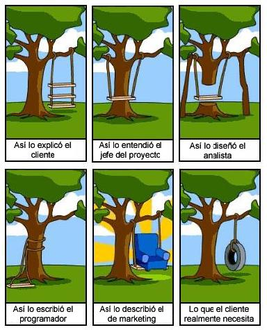

=======================================================================
Introducción al lenguaje Python
=======================================================================

Breve historia de Python
=======================================================================

El lenguaje **Python** fue creado por el Holandés **Guido Van Rossum**
a finales de la decada de los 80. Van Rossum trabajaba entonces en el
Centro para las Matemáticas y la Informática de los Países Bajos (CWI_
- *Centrum Wiskunde & Informatica*). En algún momento de 1989 empezó a
crear un nuevo lenguaje que reemplazaría al lenguaje de programación
`ABC`_, que el mismo había ayudado a desarrollar.

Inicialmente la idea era quedarse con todas las buenas ideas de ABC,
eliminar aquellas que demostraron no ser tan buenas, incorporar alguna
de los conceptos que circulaban por los entornos académicos, como el
manejo de excepciones para gestionar los errores y, sobre todo, añadir
soporte para Amoeba_, un sistema operativo distribuido desarrollado
por el equipo de `Andrew S. Tanenbaun`_ para la *Vrije Universiteit*
(en español: "Universidad Libre"), una universidad en Ámsterdam,
Holanda [#]_.

A medida que se fue desarrollando, Python incorporaba (o "tomaba
prestadas") características de otros lenguajes que parecían
prometedoras o simplemente interesantes. Desde las primeras versiones
ya se había incluido un sistema de módulos y una gestión de
excepciones directamente inspiradas en el lenguaje Modula3_
(Emparentando así con la larga tradición de lenguajes procedimentales
encabezadas por Pascal_), se le añadieron algunas primeras, o quizá
primerizas, capacidades funcionales (Las utilidades `lambda`, `map`,
`filter` y `reduce` se incorporaron desde la versión 1.0 [#]_). Para
la versión 1.4 ya se habían incluido el paso de parámetros por nombre
(herencia de Modula3 e indirectamente de `Common Lisp`_) y el soporte
de serie para números complejos.  Muchos de los problemas de gestión
de memoria de lenguajes como C se eliminarían casi totalmente con la
inclusión de un sistema de "recolección de basura", que liberaba al
programador de las tediosas -y a menudo problemáticas- operaciones de
reserva y liberación de memoria. Python 2.0 introdujo el concepto,
"robado" de lenguajes funcionales como SETL_ y Haskell_, llamado
comprensión de listas (*list comprehension*) [#]_. Python 2.2 añadio
el concepto de generadores, inspirados por el lenguaje Icon_.

Python 2.7 frente a Python 3.x
=======================================================================

Las versiones de Python 3.0 y posteriores (colectivamente llamadas
también Python 3000 o Py3K) tienen como principal objetivo corregir
determinados errores o debilidades del lenguaje. El problema de una
revisión en profundidad como esta es que no se puede mantener la
compatibilidad hacia atrás. Esto está indicado, entre otras cosas, por
el salto de numero en las versiones. El principio rector de esta
actualización fue: "reducir la duplicación de capacidades eliminando
las antiguas maneras de hacer las cosas", lo que deja bastante claro
que, en algunas cosas al menos, el código antiguo tendría que ser
modificado para que funcionara con el nuevo interprete.  La última
versión de la rama 2.x, la 2.7, está pensada como el paso natural
entre las dos ramas; las versiones 2.7.x son capaces de ejecutar, con
pequeños ajustes, tanto código 3.x como 2.x.

¿Porqué Python?
=======================================================================

Las caracterísiticas de Python lo hacen muy interesante y adecuado
para diferentes situaciones: En el ámbito educativo, es un excelente
"primer lenguaje", debido a su sintaxis elegante y a su facilidad de
lectura (ABC, el lenguaje del que deriva, era un lenguaje destinado al
aprendizaje). En el entorno científico, es apreciado por su claridad,
potencia y por el gran número de librerías adicionales que han
eclosionado a su alrededor. A los administradores de sistemas les
permite escribir programas pequeños, adecuados para resolver problemas
muy específicos, rápidamente y sin necesidad de fases de compilado
adicionales. Es muy fácil de extender y de embeber, lo que lleva a
encontrarnos el intérprete de Python en los lugares más insospechados:
dentro de juegos para ordenador, como `Eve Online`_, de programas de
animación como Blender_, o de procesado de imágenes, como Gimp_.

En este apartado veremos con más detalles algunas de las características
mas sobresalientes de Python.

Desarrollo rápido
-----------------------------------------------------------------------

Python es un lenguaje ideal para el desarrollo rápido, debido a sus
características: Lenguaje interpretado, facilidad de lectura, libertad
del programador, así como a la ingente cantidad de librerías
disponibles. La velocidad en la que se puede tener desarrollado un
prototipo funcional es enorme, comparada con lenguajes más "pesados":
Compilados, difíciles de leer, restrictivos, etc...

En muchos casos, es conveniente desarrollar un prototipo rápido, que
nos permite a la vez aprender sobre el problema en cuestión y
comprobar si nuestros diseños e ideas son adecuados.

    **Plan to throw one away. You will anyway**

    -- Fred Brooks, `The Mythical Man-Month`_

Una vez construido un prototipo, resulta más sencillo reescribir las
partes críticas en un lenguaje más eficiente -normalmente C o C++, o
incluso ensamblador, dependiendo de lo crítica que sea la velocidad de
ejecución para el proyecto. Estas partes críticas resultan muy fáciles
de identificar gracias  a las herramientas incorporadas de análisis de
rendimiento, y al `principio de pareto`_ o regla del 80-20.

En el peor de los casos, habría que reescribir todo el código usando
un lenguaje más eficiente, como C, pero aun y así, es mucho más fácil
programar teniendo como referencia un programa funcional [#]_ que unas
especificaciones técnicas, no importa lo elaboradas que sean.

Sencillo (pero potente)
-----------------------------------------------------------------------

Python es un lenguaje de uso general, con el que somos capaces de
escribir desde un sencillo *script* de 20 líneas a un complejo
desarrollo de miles de líneas de código (Django_, un potente
*framework* de desarrollo web escrito en Python, consta de una 66.000
líneas de código). Sin embargo, esta potencia no proviene de una
sintaxis oscura ni complicada, sino todo lo contrario.

Aunque la sintaxis de Python aun mantiene algún que otro rincón
relativamente oscuro, estos rincones son pocos y normalmente bien
señalizados. Por lo general se pueden evitar o aislar en unos pocos
módulos o clases. Por supuesto, si uno se esfuerza es perfectamente
posible escribir código python confuso y difícil de leer, pero la
mayor parte del código es, por lo general, casi tan fácil de leer como
el psuedo-codigo.

Eric S. Raymond, en el `New Hacker's Dictionary`_, da la siguiente
definición de *compacto*:

    **compacto** adj. Dicho de un diseño, describe la deseable
    propiedad de poder ser aprehendido de una vez en la cabeza de uno. por
    lo general, esto significa que los objetos creados a partir de dicho
    diseño tienden a ser más fáciles de usar y provocan menos errores que
    una herramienta equivalente que no sea compacta.

    El ser compacto no implica trivialidad o falta de potencia: Por
    ejemplo, el lenguaje C es más compacto que Fortran, y a la vez,
    más potente. Los diseños devienen no compactos a medida que se les
    agregan capacidades y lastres que no encajan de forma natural
    con el esquema general del diseño (De ahí que muchos fans del C
    clásico mentengan que el ANSI C ya no es compacto).

En este sentido, Python es muy compacto: consiste en unas pocas ideas,
reutilizadas en múltiples sitios. Tomemos por ejemplo los espacios de
nombres: Si importamos un nuevo módulo con `import math`, estamos
creando un nuevo espacio de nombres llamado `math`. Las clases son
espacios de nombres que comparten muchas de las propiedades de los
módulos, y añaden unas pocas más. Las instancias de objetos son, de
nuevo, espacios de nombres. Los espacios de nombres están
implementados como diccionarios de python, así que tienen los mismos
métodos que cualquier diccionario: `keys()` retorna una lista de
claves, etc...

Python es simple porque es compacto, no porque sea limitado. No se
debe subestimar la importancia de la simplicidad: no solo nos permite
aprender el lenguaje más rápido, también nos permite luego escribir
más rápido, corregir más rápido y cometer menos errores.

Fácil de leer
-----------------------------------------------------------------------

Normalmente el software se escribe una vez, pero se lee muchas, a
medida que se revisa en busca de errores o se modifica. De ahí parte
la filosofía de que, más importante que ser fácil de escribir, un
lenguaje debe ser fácil de leer.

    **Programs must be written for people to read, and only
    incidentally for machines to execute.**

    -- Abelson & Sussman, `Structure and Interpretation of Computer Programs`_

A medida que fue evolucionando, muchas de las decisiones claves que
ahora definen el lenguaje se tomaron principalmente para poder hacer
el código más legible.

La mayor parte de la gente con experiencia en programación, e incluso
muchas personas que nunca han programado, pueden leer, y en la mayoría
de los casos interpretar correctamente, lo que hace una parte de
código escrita en Python.

Como ejemplo, veamos el siguiente fragmento de código:

.. literalinclude:: ../ejemplos/media.py
    :language: python
    :start-after: # starts here
    :end-before: # ends here

¿Puede adivinar la salida del programa?

    Promedio = 24.8

Otra forma de escribir el programa podría ser::

    lista = [7, 23, 44, -2, 52]
    print("Promedio = ", sum(lista)/len(lista))

Fácil de aprender
-----------------------------------------------------------------------

En python se ha logrado esta facilidad de aprender en parte gracias a
su diseño compacto, y también son importantes todos los esfuerzos
hechos para que fuera fácil de leer, como vimos antes. Pero quiza lo
mas determinante es que se puede aprender por niveles. Se puede
empezar utilizando el paradigma de la programación imperativa, pasar a
la programación orientada a objetos y seguir explorando las
posibilidades de la programación funcional.

Esto se consigue porque, aunque incorpora la posiblidad de trabajar
con clases y objetos, esto no es obligatorio. De igual manera, aunque
incorpora muchos aspectos de programación funcional, no es necesario
usarlos si no se desea. A medida que leemos y aprendemos más
posibilidades, el lenguaje va creciendo con nosotros, por así decirlo.

No se entromete (entre tú y el problema)
-----------------------------------------------------------------------

Cuanto llegas a tener cuerta familiaridad con el lenguaje, te resulta
muy fácil concentrarte en resolver un problema o en implementar un
algoritmo, sin preocuparte por los detalles, a menudo enojosos, de la
implementación.

Esto se debe en parte a la facilidad de leer el código, a su sintaxis
compacta y a que las estructuras de datos y las de control se combinan
entre si para ofrecer mucha más potencia. Mientras que en otros
lenguajes necesitas crear estructuras de datos adicionales para dar
soporte al problema, en Python a menudo descubres -a veces, con cierto
placer culpable- que usando las predefinidas (tuplas, listas,
conjuntos y, sobre todo, diccionarios) es más que suficiente.

Evidentemente, también ayuda la potencia de la librería estándar,
aunque esta no sea, estrictamente hablando, una característica del
lenguaje.

Interprete y modo interactivo
-----------------------------------------------------------------------

El :term:`intérprete` interactivo de Python permite a los entudiantes probar
las caracteristicas y posibilidades del lenguaje a la vez que
programan. Es habitual mantener una ventana con el interprete
funcionanado, y en otra el editor del código. Si en  un momento dado
no podemos recordar cuales eran los métodos  disponibles para las
listas, podemos recurrir al intérprete::

    >>>
    >>> l = [1, 2, 3, 5, 1, 5, 5]
    >>> dir(l)
    ['append', 'count', 'extend', 'index', 'insert', 'pop', 'remove',
    'reverse', 'sort']
    >>> help(l.count)
    Help on built-in function count(...)

    L.count(value) -> integer -- return number of occurrences of value
    >>> l.count(5)
    3

Gracias al intérprete, la documentación siempre está accesible cuando
programamamos.

"Hola, mundo" en Java
-----------------------------------------------------------------------

El programa `Hola, Mundo`_ es una convención usada a menudo para dar
el primer paso cuando estamos aprendiendo un nuevo lenguaje de
programación [#]_. La idea es hacer el programa **más sencillo posible**
que sea capaz de hacer algo; normalmente consiste en escribir el texto
"hola mundo" en algún sitio. Aquí podemos encontrar `versiones del
hola, mundo`_ para múltiples lenguajes.

Veamos el ejemplo típico del "hola, mundo" en Java:

.. literalinclude:: ../ejemplos/HolaMundo.java
    :language: java

"Hola, mundo" en python
-----------------------------------------------------------------------

El código en Python es::

    print("Hola, Mundo")

Interpretado (Pero también compilado)
-----------------------------------------------------------------------

Desde una terminal, si escribimos `python`, veremos que el programa
mostrará información acerca de la versión y sistema python que tenemos
instalado, tras lo cual imprime tres caracteres >>>

Python es un lenguaje compilado, en realidad, basado en una máquina
virtual sobre la que se ejecuta el *bytecode*.

Diferentes paradigmas de programación
-----------------------------------------------------------------------

Lenguajes procedurales
~~~~~~~~~~~~~~~~~~~~~~~~~~~~~~~~~~~~~~~~~~~~~~~~~~~~~~~~~~~~~~~~~~~~~~~

Un lenguaje procedimental, como su nombre indica, hace incapíe en
procesos (funciones o procedimientos) que cambian el estado del
programa. Un programa imperativo es una secuencia de instrucciones que
indican como se realiza una tarea.

Lenguajes como ensamblador o código máquina son por naturaleza
imperativos, ya que reflejan la arquitectura de Máquinas de Turing. El
estado del programa está almacenado en la memoria, y es modificado por
la consecutivas instrucciones de bajo nivel.

Los lenguajes imperativos de más alto nivel utilizan el paradigma de
la programación estructurada, cuyos objetivos son mejorar la claridad,
calidad y tiempos de desarrollo mediante el uso de variables y
sentencias más complejas, como subrutinas, bloques de código y el uso
de bucles de tipo ``for/while`` y sentencias ``if/else``, en vez de
sentencias ``goto``, considerada una mala práctica porque suelen
derivar en código fuente confuso (*spaghetti code*), difícil de
entender y de mantener.

Programación orientada a objetos
~~~~~~~~~~~~~~~~~~~~~~~~~~~~~~~~~~~~~~~~~~~~~~~~~~~~~~~~~~~~~~~~~~~~~~~

La programación orientada a objetos (A veces abreviada POO o OOP
según sus siglas en inglés) es un paradigma de programación que se
basa en objetos, y en las interacciones entre ellos, para diseñar
programas informáticos. Permite el uso de abstracciones de
más alto nivel, como herencia, encapsulación, polimorfismo,
sobrecarga de operadores, abstracción, etc...

La mayoría de los conceptos de la programación orientada a objetos
provienen del lenguaje `Simula 67`_, un lenguaje diseñado en los años
60 principalmente para hacer simulaciones, como su nombre sugiere. Las
ideas de Simula 67 influyeron sobre muchos lenguajes posteriores,
incluyendo Smalltalk_, derivados de LISP (CLOS_), Object Pascal, y C++.
El uso de este paradigma se popularizó a partir de la década de los
90. En la actualidad, existen múltiples lenguajes de programación que
soportan la orientación a objetos.

Los objetos se caracterizan por mantener un determinado estado
interno, por tener asociados ciertos comportamientos (métodos) y por
tener una identidad única en el sistema. Así, un objeto contiene toda
la información necesaria para definirlo y para identificarlo frente a
otros objetos. Los mensajes permiten la comunicación y cooperación
entre objetos. Varios objetos pueden compartir los mismos métodos,
pudiendo agrupándose entonces en una misma clase, lo que permite la
reutilización de código.

La programación estructurada tradicional y la POO se diferencian en
en que, en la primera, datos y procedimientos son entidades separados
y sin relación. La programación estructurada anima al programador a
pensar primero en términos de procedimientos o funciones, y en segundo
lugar en las estructuras de datos que esos procedimientos manejan. Los
programadores que emplean POO, en cambio, definen objetos que se
relacionan y coordinan entre si mediante mensajes. Cada objeto se
considera una unidad indivisible, una amalgama de estado (datos) y
comportamiento (métodos y mensajes).

Programación funcional
~~~~~~~~~~~~~~~~~~~~~~~~~~~~~~~~~~~~~~~~~~~~~~~~~~~~~~~~~~~~~~~~~~~~~~~

La programación funcional es un paradigma de programación declarativa
basado en la utilización de funciones que no manejan datos
mutables o de estado. Enfatiza la aplicación de funciones, en
contraste con el estilo de programación imperativa, que enfatiza los
cambios de estado. La programación funcional tiene sus raíces en el
cálculo lambda, un sistema formal desarrollado en los 1930s para
investigar la definición de función, la aplicación de las funciones y
la recursión. Muchos lenguajes de programación funcionales pueden ser
vistos como elaboraciones del cálculo lambda.

En la práctica, la diferencia entre una función matemática y la noción
de "función" en programación imperativa radica en que las
funciones imperativas pueden tener efectos secundarios, al cambiar el
valor de cálculos realizados previamente. Se dice por tanto que carecen de
**transparencia referencial**, es decir, que una llamada a una función
podría devolver diferentes valores, dependiendo del estado del programa.
Con código funcional, por el contrario, el valor generado por una función
depende única y exclusivamente de los argumentos de la función. Al eliminar
los efectos secundarios se puede entender y predecir el comportamiento
de un programa mucho más fácilmente, y esta es una de las principales
motivaciones para utilizar la programación funcional.

Para qué no es bueno Python
=======================================================================

Python, por sus características, no es adecuado para los siguientes
campos:

 - Desarrollo a bajo nivel ("Cerca de la máquina"), como drivers,
   kernels o sobre hardware limitado. Al ser un lenguaje de alto
   nivel, no hay control directo sobre el hardware, depende de
   los servicios del S.O.

 - Aplicaciones que requieran sobre todo alta capacidad de
   cómputo, o aquellas en que sea crítico obtener el máximo
   rendimiento posible; aquí la respuesta sigue siendo C
   o ensamblador.

 - Las aplicaciones multi-hilo o multi-thread sobre sistemas
   con múltiples procesadores pueden tener problemas de rendimiento
   si no se tienen en cuenta las restricciones que impone el GIL
   (Global interpreter Lock).

Filosofía del lenguaje Python
=======================================================================

Abrir el interprete de python
y escribir `import this`:

The Zen of Python, by Tim Peters

 - Bello es mejor que feo.
 - Explícito es mejor que implícito.
 - Simple es mejor que complejo.
 - Complejo es mejor que complicado.
 - Plano es mejor que anidado.
 - Disperso es mejor que denso.
 - La legibilidad cuenta.
 - Los casos especiales no son tan especiales como para quebrantar las reglas.
 - Aunque lo práctico gana a la pureza.
 - Los errores nunca deberían dejarse pasar silenciosamente.
 - A menos que hayan sido silenciados explícitamente.
 - Frente a la ambigüedad, rechaza la tentación de adivinar.
 - Debería haber una -y preferiblemente sólo una- manera obvia de hacerlo.
 - Aunque esa manera puede no ser obvia al principio a
   menos que usted sea Holandés
 - Ahora es mejor que nunca.
 - Aunque nunca es a menudo mejor que ya mismo.
 - Si la implementación es difícil de explicar, es una mala idea.
 - Si la implementación es fácil de explicar, puede que sea una buena idea.
 - Los espacios de nombres (namespaces) son una gran
   idea ¡Hagamos más de esas  - cosas!

REPL o uso en línea de comandos
=======================================================================

La función ``help``
------------------------------------------------------------------------

La función ``help()``, si la llamamos sin ningúin parámetro,  nos
muestra una interfaz de ayuda interactiva, desde la que podemos
interrogar al sistema por cualquier módulo, palabra clave o tema de
interes sobre programación en Python.

Para salir del sistema de ayuda y volver al interprete, teclear
la orden ``quit``.

Si le pasamos un objeto, nos mostrará la información del objeto
que pueda conseguir, incluyendo la documentación embebida, si
se ha incluido, y la informaciñon que pueda obtener a partir de
la función ``dir()`` (explicada a continuación).

la función ``dir``
------------------------------------------------------------------------

La función ``dir`` puede ser llamada sin parámetros o con un parámetro. Si
se la llama sin parámetros, devuelve los nombres de variables accesibles
desde el ámbito (*scope*) desde el que se llama::

    >>> dir()
    ['__builtins__', '__doc__', '__name__', '__package__']
    >>> a = 3
    ['__builtins__', '__doc__', '__name__', '__package__', 'a']
    >>> def f(x): x*x
    ...
    >>> dir()
    ['__builtins__', '__doc__', '__name__', '__package__', 'a', 'f']
    >>>

Si le pasamos un parámetros, devolverá una lista, en orden alfabético, de algunos
de los atributos del objeto, o de atributos accesibles desde
él. Su comportamiento por defecto es:

 - Si le pasamos un módulo, devolverá una lista de los atributos
   definidos en el módulo.

 - Si le pasamos una clase, devolverá una lista de sus atributos, más
   aquellos atributos definidos en las clases de las que herede.

 - Para cualquier otro objeto, devolverá sus atributos, los atributos de
   su clase y los atributos definidos en las clases de las que herede
   su clase.

Entornos alternativos: IPython, bPython
------------------------------------------------------------------------

Además del entorno REPL estándar de Python, existen varias versiones
alternativas que añaden utilidades, interfaces o facilidades, manteniendo
las capacidades del interprete Python. Entre los más interesantes
cabe destacar IPython_ y bPython.

.. _ABC: http://en.wikipedia.org/wiki/ABC_%28programming_language%29
.. _Amoeba: http://en.wikipedia.org/wiki/Amoeba_distributed_operating_system
.. _Andrew S. Tanenbaun: http://en.wikipedia.org/wiki/Andrew_S._Tanenbaum
.. _Blender: http://www.blender.org/
.. _Common Lisp: http://en.wikipedia.org/wiki/Common_lisp
.. _CLOS: http://en.wikipedia.org/wiki/Common_Lisp_Object_System
.. _CWI: http://www.cwi.nl/
.. _Django: http://www.djangoproject.com/
.. _EVE Online: http://www.eve-online.com/
.. _Fortran: http://en.wikipedia.org/wiki/Fortran
.. _Gimp: http://www.gimp.org/
.. _Haskell: http://en.wikipedia.org/wiki/Haskell_%28programming_language%29
.. _Icon: http://en.wikipedia.org/wiki/Icon_%28programming_language%29
.. _IPython: http://ipython.org/
.. _Hola, Mundo: http://es.wikipedia.org/wiki/Hola_mundo
.. _Modula3: http://en.wikipedia.org/wiki/Modula-3
.. _Monty Python: http://en.wikipedia.org/wiki/Monty_Python
.. _New Hacker's Dictionary: http://www.catb.org/~esr/jargon/html/C/compact.html)
.. _Pascal: http://en.wikipedia.org/wiki/Pascal_%28programming_language%29
.. _principio de pareto: http://es.wikipedia.org/wiki/Principio_de_Pareto
.. _Structure and Interpretation of Computer Programs: http://en.wikipedia.org/wiki/Structure_and_Interpretation_of_Computer_Programs
.. _SETL: http://en.wikipedia.org/wiki/SETL
.. _Simula 67: http://en.wikipedia.org/wiki/Simula
.. _Smalltalk: http://en.wikipedia.org/wiki/Smalltalk
.. _The Mythical Man-Month: http://en.wikipedia.org/wiki/The_Mythical_Man-Month
.. _versiones del hola, mundo: http://www.roesler-ac.de/wolfram/hello.htm

.. rubric:: Footnotes

.. [#] La Vrije Universiteit es conocida también como «VU University».

.. [#] Segun Guido Van Rossum, por un agradecido hacker de Lisp que, al
       parecer, las echaba de menos y escribió un parche para
       incluirlas.

.. [#] La sintaxis de Python para esta estructura es prácticamente idéntica a
       la de Haskell, si no tomamos en cuenta la preferencia de Haskell
       por los signos de puntuación frente a la de Python por palabras claves
       alfebéticas.

.. [#] Siempre y cuando dispongamos del código fuente, claro.

.. [#] Siempre había existido la constumbre de realizar pequeños programas
       de prueba o para el aprendizaje de nuevos lenguajes, pero la
       costumbre de formalizarlo y darle nombre corresponde a
       Brian Kernighan y Dennis Ritchie en su mítico libro "El lenguaje de programación C".

.. [#] Este desarrollo de interpretes alternativos seguramente se debe,
       al menos en parte, a la facilidad para embeber el intérprete de
       Python en nuestros propios programas.
