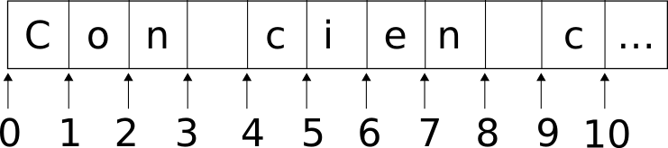

=======================================================================
Día 1.- El Lenguaje de Programación Python
=======================================================================

Nombres de variables
-----------------------------------------------------------------------

Los nombres de variables deben empezar con un caracter no numérico, el
resto pueden ser letras, números y el caracter ``_``. Python distingue
entre mayúsculas y minúsculas, así que el nombre ``a`` es diferente
de ``A``.

Existen una serie de **palabras reservadas** por python, que no se
pueden usar como nombres::

    and                 elif                if                  print
    as                  else                import              raise
    assert              except              in                  return
    break               exec                is                  try
    class               finally             lambda              while
    continue            for                 not                 with
    def                 from                or                  yield
    del                 global              pass

Además, hay ciertas variables y funciones "mágicas" usadas por python
y que tienen significados especiales, estas son facilmente
reconocibles porque siempre empiezan con dos caracteres ``_`` y
terminan igualmente por dos caracteres ``_``. Ejemplos de estas
variables son ``__name__``, ``__doc__`` e ``__init__``.

Tipos de datos simples
-----------------------------------------------------------------------

En Python hay tres tipos de datos básicos: Textos, números, y valores
lógicos (Verdadero/Falso). Pero cada tipo básico es posible que se
represente usando diferentes clases, por razones que veremos más
adelante. Una definición de tipo la explicación de los valores que se
pueden almacenar usando dichos tipos, así como los operadores que
pueden ser usados con dichos valores.

Logicos (bool)
~~~~~~~~~~~~~~~~~~~~~~~~~~~~~~~~~~~~~~~~~~~~~~~~~~~~~~~~~~~~~~~~~~~~~~~

Los valores lógicos o *booleanos* son llamados así en honor a `George
Bool`_, inventor de la lógica booleana. Las variables booleanas solo
pueden tener dos valores posibles: `True` (Verdadero) o `False`
(Falso). Los operadores que trabajan con estos valores son `and`, `or`
y `not`.

Los valores lógicos se utilizan sobre todo en condicionales. Cuando
realizamos una comparación con uno de los operadores ``<``, ``<=``,
``>``, ``>=``, ``==``, ``!=`` o ``<>``, el resultado de la operación
es un booleano. Si abrimos la shell de python y probamos a escribir
simplmente::

    >>> 7 > 2
    True
    >>> 2 <= -23
    False
    >>> 3 == 3
    True

Existe una función `bool` que intenta convertir cualquier valor que se
le pase a un valor booleano, siguiendo ciertas reglas, que se resumen
en: la constante None, el número cero y las secuencias, tuplas,
conjuntos y diccionarios vacíos se considera `False`. Cualquier otra
cosa se considera True.

Números (int, long, float, decimal, complex)
~~~~~~~~~~~~~~~~~~~~~~~~~~~~~~~~~~~~~~~~~~~~~~~~~~~~~~~~~~~~~~~~~~~~~~~

En python, existen varias tipos de números. Cada uno de ellos almacena los
valores de forma distinta, pero comparten el mismo conjunto de operadores, que
es el que podemos esperar de cualquier numero:


========  ====================  ===================================
Operador  Significado           Ejemplo
========  ====================  ===================================
``+``     suma                  12 + 23 -> 35
``-``     resta                 12 - 6 -> 6
``/``     división              7 / 2 -> 3.5 (o 3 en Python 2.x)
``//``    division entera       7 / 2 -> 3
``%``     módulo                7 % 2 -> 1
``*``     multiplicación        2 * 10 -> 20
``**``    exponenciación        2 ** 10 <> 1024
``&``     AND a nivel de bits   26 & 1314 -> 2 (Solo para enteros)
``|``     OR a nivel de bits    1 | 2 -> 3 (Solo para enteros)
``^``     XOR a nivel de bits   3 ^ 5 -> 6 (Solo para enteros)
========  ====================  ===================================


Tenemos los **números enteros**, que se corresponden con los números
naturales, positivos y negativos. Una ventaja de Python sobre otros
lenguajes es que no hay límite para el tamaño de los numeros enteros
que podemos usar. Mejor dicho, el límite es la memoria RAM de la que
dispongamos. Por ejemplo::

    >>> 2**1024
    1797693134862315907729305190789024733617976978942306572734300811577326758
    0550096313270847732240753602112011387987139335765878976881441662249284743
    0639474124377767893424865485276302219601246094119453082952085005768838150
    6823424628814739131105408272371633505106845862982399472459384797163048353
    56329624224137216

Para crear una variable entera, solo hay que asignarle un valor
que sea entero::

    >>> a = 23

Ya que estamos, un valor se puede asignar a varias variables en una
sola línea::

    >>> a = b = c = d = 99


En python 2.7, había dos clases de enteros: la clase ``Int`` y la
clase ``Long``, y  la conversión entre ambos tipos era automática.
En python 3.0 hay un solo tipo. Es otro de los cambios
introducidos para limpiar el polvo acumulado de los que hablaba
antes.

Además de los enteros, tenemos también los **números reales** o en coma
flotante, que en Python se corresponden con el tipo ``float``.  Para
crear un numero en coma flotante solo tenemos que iniciar la variable
con un valor que incluya el punto decimal, o usar la notación
cientifica ``<coeficiente>e<exponente>``. Por  ejemplo, todas las
líneas siguientes crean variables en coma flotante::

    >>> a = 23.0
    >>> b = 3.141592653589793
    >>> c = .23
    >>> d = 1e-3

Abramos una terminal de python y probemos el siguiente código, pero
antes de ejecutarlo, ¿Cuál creen que será el resultado, ``True`` o
``False``?

    >>> a = 0.1+0.1+0.1+0.1+0.1+0.1+0.1+0.1+0.1+0.1
    >>> b = 1.0
    >>> a == b

.. sidebar:: Implementación de float en Python

    Python está escrito en C, e implemente los ``float`` con el tipo
    ``double`` o de doble precisión de C, es decir que los ``float``
    utilizan 64 bits, siguiendo el estándar IEEE 754 para ese tamaño:
    1 bit para signo, 11 para el exponente, y 52 para el coeficiente.
    Esto significa que los valores que podemos representar van desde
    ±2,2250738585072020x10\ :sup:`-308` hasta
    ±1,7976931348623157×10\ :sup:`308`.

Python, como la mayoría de los lenguajes, utiliza el estándar de la IEEE para aritmética en coma flotante (`IEEE 754`_). Con esta representación, algunos
números no se pueden representar de forma exacta. Pasa lo mismo con la
notación decimal: podemos representar con exactitud 1/4 como 0.25, pero
1/3 es 0.33333333333333... y así hasta el infinito. Como tenemos un espacio
de memoria máximo para almacenar el número, esto implica que algunos de estos
números se almacenarán con un error. Un error infinitesimal, pero error a fin
de cuentas. El problema de estos errores viene cuando empezamos a acumular
valores y, por tanto, a acumular errores. El valor 0.1
es uno de esos valores que no tiene representación exacta en IEEE 754, así
que las repetidas sumas van acumulando el error. Si queremos saber el valor
exacto del mismo podemos hacer::

    >>> a = 0.1+0.1+0.1+0.1+0.1+0.1+0.1+0.1+0.1+0.1
    >>> b = 1.0
    >>> a - b
    -1.1102230246251565e-16

Un valor insignificante, pero aun así suficiente para que los dos
valores no sean iguales (1.0 si tiene representación exacta en IEEE 754)

Normalmente estos problemas se resuelven redondeando hasta la
exactitud que necesitemos (por lo general muy por encima  de
0.0000000000000001), pero Python introduce tambien un tipo de numero
especial, **Decimal**, pensado especialmente para los calculos con un
tamaño fijo decimal, normalmente esto significa que son los que
usaremos para guardar información monetaria. Para  poder usar estos
números tenemos que hacer una operación especial antes, una
**importación** de un módulo, que nos permite usarlos. La orden que
realiza esta importación en  concreto es::

    from decimal import Decimal

Usando numeros decimales no incurrimos en ningún error de este tipo; hagamos
la prueba anterior, pero ahora con números decimales::

    >>> from decimal import Decimal
    >>> a = Decimal('0.1')+Decimal('0.1')+Decimal('0.1')+Decimal('0.1') \
    ...     + Decimal('0.1')+Decimal('0.1')+Decimal('0.1')+Decimal('0.1') \
    ...     + Decimal('0.1')+Decimal('0.1')
    >>> b = Decimal('1.0')
    >>> a == b
    True

Como curiosidad, comentar que, en modo interactivo, se crea una variable
"mágica", ``_``, que siempre contiene el resultado de la última
expresion evaluada. Cuando usamos el interprete como calculadora, puede
ser muy cómodo tener ese valor::

    >>> impuestos = 17.5 / 100
    >>> precio = 3.50
    >>> precio * impuestos
    0.6125
    >>> precio + _
    4.1125

Por último, Python incorpora también **números imaginarios** o
**complejos**. Los números imaginarios se declaran añadiendo el sufijo
``j`` o ``J`` a la parte imaginaria. Para definir un número con parte
real e imaginaria se usa la sintaxis (real+imagj), o bien los podemos
crear usando la  función ``complex(real, imag)``::

    >>> a = (3+4j)
    >>> type(a)
    >>> <type 'complex'>

La función ``type`` es muy util, le pasamos entre parentesis una
variable y nos dice el tipo al que pertenece.

Se pueden extraer las partes reales e imaginarias de un número
complejo ``z`` usando ``z.real`` y ``z.imag``. La función ``abs(z)``
nos daría su magnitud::

    >>> z = (3+4j)
    >>> z.real
    3.0
    >>> z.imag
    4.0
    >>> abs(z)
    5.0

Cadenas de Textos (string y unicode)
~~~~~~~~~~~~~~~~~~~~~~~~~~~~~~~~~~~~~~~~~~~~~~~~~~~~~~~~~~~~~~~~~~~~~~~~~~~~~~~

En Python las variables de texto se pueden expresar como literales
usando comilla simples o dobles, indistintamente. Si tenenos la
necesidad de incluir en el texto las propias comillas (simples o
dobles, según corresponda) podemos hacerlo precediendo (En jerga de
programadores, "escapando") a la comilla con el caracter ``\`` (barra
invertida). Si el texto ocupa  varias líneas o queremos
despreocuparnos de tener que escapar las comillas simples o dobles
dentro del texto, podemos usar como delimitadores tanto tres comillas
simples como tres comillas dobles. Por ejemplo, las siguientes
declaraciones de variables tipo ``String`` son todas validas::

    >>> a = 'Hola, mundo'
    >>> b = 'It\'s seven o\'clock in the morning'
    >>> c = "It's seventeen o'clock in the morning"
    >>> d = "He said: \"Luke, I'm your father\""
    >>> e = 'He said: "Luke, I\'m your father"'
    >>> f = '''He said: "Frankly, my dear, I don't give a damn."'''
    >>> g = """He said: "Frankly, my dear, I don't give a damn."""
    >>> h = '''Vader: Obi-Wan never told you what happened to your father.
    ... Luke: He told me enough! He told me YOU killed him.
    ... Vader: No, I am your father.
    ... Luke: NOOOOOOOOOOOOOOOOOOOooooo!!
    ... '''

En Python 2.7 y anteriores, se anteponía una ``u`` antes del delimitador
del literal para indicar que el texto era unicode::

    >>> # solo en python 2.7
    >>> a = u'Cadena de texto unicode'

En Python 3.x, todas los literal son unicode por defecto, así que ya no tiene
sentido esta notación; al contrario, tendremos que indicar cuando no es
unicode, sino una string de texto codificado o códigos binarios, anteponiendo
una ``b``::

    >>> solo en python 3.x
    >>> a = b'Cadena de texto codificada. ¿Pero... con qué coded?'

Las operaciones que podemos hacer con las cadenas son muy variadas. Pueden
ser unidas o concatenadas, con el operador ``+``, y repetidas con ``*``::

    >>> saludo = "Hola," + "Mundo"
    >>> saludo
    'Hola,Mundo'
    >>> linea = "-" * 22
    >>> linea
    '----------------------'

La función predeterminada ``len`` nos devuelve la longitud de
una cadena, es decir, el número de caracteres::

    >>> print(len('Hola, mundo'))
    11

Las cadenas de texto permiten que se acceda a su contenido mediante índices,
siendo el 0 la primera letra. Piensese en el índice no como una
posición, sino como "El número de caracteres que hay antes del que
me interesa". Ĺa forma de acceder es indicando el índice entre corchetes,
después de la variable o string. Si usamos índices negativos, entonces la
cuenta empieza desde la derecha, o sea, desde el final de la string::

    >>> s = 'Con cien cañones por banda,'
    >>> s[0]
    'C'
    >>> s[5]
    'i'
    >>> s[-1]
    ','
    >>> s[0] != s[-1]
    True

También podemos extraer subcadenas o **slices** a partir de una cadena
mayor, usando la sintaxis ``[``<límite inferior>``:``<límite
superior>``]``. Si se omite el límite inferior, se supone un 0 (Es
decir, desde el principio de la línea); si se omite el límite
superior, se supone la longitud total de la cadena (es decir, hasta el
final). Si se omiten los dos límites, obtendremos la
cadena de texto original::

    >>> s = 'Con cien cañones por banda,'
    >>> s[0:3] # los  primeros tres caracteres
    'Con'
    >>> s[:8]  # los  primeros ocho caracteres
    'Con cien'
    >>> s[8:]  # todo, excepto los  primeros ocho caracteres
    ' cañones por banda,'
    >>> s[4:8]
    'cien'
    >>> s[-6:]
    'banda,'
    >>> s2 = s[:]
    >>> s == s2
    True

Los excesos en los índices en estas operaciones se manejan con cierta
indulgencia: Si un índice resulta demasiado grande, es reemplazado
por la longitud de la cadena; si se especifica un límite inferior
más grande que el límite superior se obtiene una string vacia::

    >>> name = 'Anakin Skywalker'
    >>> name[0:100]
    'Anakin Skywalker'
    >>> name[5:1]
    ''

Pera estas operaciones de "rebanado" o *slicing* resulta muy adecuada
pensar que los índices apuntan a los espacios entre las letras, y no
a las letras en sí, como se muestra en el siguiente gráfico:




no podemos modificar una parte de un texto usando estas expresiones,
ni con índices ni con subcadenas::

    >>> s = 'Con cien cañones por banda,'
    >>> s[0] = 'P'
    Traceback (most recent call last):
    File "<stdin>", line 1, in <module>
    TypeError: 'str' object does not support item assignment
    >>> s[4:8] = 'doscientos'
    Traceback (most recent call last):
    File "<stdin>", line 1, in <module>
    TypeError: 'str' object does not support item assignment

Pero si que podemos crear una nueva variable a partir
de estas expresiones::

    >>> s = 'Con cien cañones por banda,'
    >>> s = s[:4] + 'doscientos' + s[8:]
    >>> print(s)
    'Con doscientos cañones por banda'


Esto es así porque las cadenas de texto, al igual que todos los tipos
de datos que hemos visto hasta ahora, son **inmutables**. Esto significa
que, una vez creada una variable de un tipo inmutable, esta *nunca*
cambia de valor. Dentro de poco, veremos que hay tipos de datos
que si son mutables; mientras tanto, lo que hay que explicar es: si
las strings son inmutables, ¿Cómo es que el siguiente ejemplo no da
error?

.. literalinclude:: ../ejemplos/inmutable_01.py
    :language: python
    :lines: 6-8

La respuesta es que Python crea una nueva string, uniendo las dos
anteriores, y reasigna el nombre ``s1`` a la nueva String. Podemos
comprobarlo usando la funcion ``id()``, que nos devuelve un
identificador de la variable que le pasemos; si dos objetos tienen el
mismo identificador, entonces son en realidad el mismo objeto.  Si
probamos con esta segunda versión veremos que imprime dos números
diferentes, es decir s1 apunta a una variable diferente la segunda vez:

.. literalinclude:: ../ejemplos/inmutable_02.py
    :language: python
    :lines: 6-10
    :emphasize-lines: 2,4

None (TypeNone)
~~~~~~~~~~~~~~~~~~~~~~~~~~~~~~~~~~~~~~~~~~~~~~~~~~~~~~~~~~~~~~~~~~~~~~~~~~~~~~~

El valor especial `**None**` no es un tipo de dato, sino un valor
constante especial, cuyo significado viene a ser "ausencia de valor"
(Similar al valor especial ``NULL`` de SQL). Si una función no especifica
un valor de retorno, este es `None`. `None` tiene su propio tipo de
variable específica: `NoneType`.

Podemos comprobar si un valor es None con el operador ``is``, o ``is not``:

    >>> a = 12
    >>> a is None
    False
    >>> a is not None:
    True

Tipos de datos compuestos
-------------------------------------------------------------------------------

Los siguientes tipos de datos que veremos son llamados *compuestos*, porque
sirven para agrupar distintas variables en una sola.

Listas
~~~~~~~~~~~~~~~~~~~~~~~~~~~~~~~~~~~~~~~~~~~~~~~~~~~~~~~~~~~~~~~~~~~~~~~~~~~~~~~

La lista es la estructura más habitual, consiste en una enumeración o lista
de variables, siendo el orden de la misma importante, porque es precisamente
usando ese orden como después podremos acceder a los valores individuales. En
Python una lista se indica abriendo corchetes: ``[``, a continuación
las variables, valores o expresiones que formarán parte de la lista
y acabamos cerrando los corchetes: ``]``. Descrito así, parece mucho
más complicado; veamos un ejemplo::

    >>> a = ['Maria', 4, 723.4, None]

En otros lenguajes, la lista o ``array`` de datos solo puede contener
un determinado tipo de datos; por ejemplo, una lista de enteros. En
Python, como vemos, en la lista se pueden guardar cualquier tipo de
datos.

Al igual que las cadenas de texto, las listas se acceden usando un índice,
que de nuevo empieza por cero. También podemos usar "rebanadas" o *slices*,
exactamente igual que con las strings, y tambien podemos concatenarlas
usando el operador ``+``:

    >>> a = ['Maria', 4, 723.4, None]
    >>> a[0]
    'Maria'
    >>> a[1:3]
    [4, 723.4]
    >>> a[-2:]
    [723.4, None]
    >>> a + [(6+7j), True]
    ['Maria', 4, 723.4, None, (6+7j), True

Tiene sentido, si pensamos que una cadena de textos al final viene a ser
como una lista de caracteres.

Todas las operaciones de rebanado devuelven una nueva lista, que contiene
los elementos indicados. Una forma habitual de obtener una copia de una
lista es usando ``[:]``; al omitir los límites inferior y superior
estos son sustituidos por "desde el principio" y "hasta el final":

    >>> a = ['Maria', 4, 723.4, None]
    >>> b = a[:]
    >>> a == b
    True
    >>> a is b
    False

Pero, al contrario que las cadenas de texto, las listas si son *mutables*. Es
posible cambier elementos individuales dentro de la lista::

    >>> a = ['Maria', 4, 723.4, None]
    >>> a[1] = a[1] + 6

Incluso es posible hacer aquello que no podiamos con las strings, asignar
a una rodaja, aunque esto cambie el tamaño de la lista o incluso
la deje totalmente vacia::

    >>> a = [1,2,3,4]
    >>> a[1:3] = [2.0, 2.1, 2.3, 2.5, 2.7, 2.9, 3.0]
    >>> print(a)
    [1, 2.0, 2.1, 2.3, 2.5, 2.7, 2.9, 3.0, 4]
    >>> a[:] = [] # Borramos todo el contenido de la lista
    >>> print(a)
    []

La función ``len``, que en el caso de las cadenas de textos nos
retornaba su longitud, aplicada a una lista nos devuelve
el número de elementos de la lista.

    >>> l = [1,2,3,4]
    >>> print(len(l))
    4
    >>> s = '¡Es una trampa!'
    >>> print(len(s))
    16

Las listas pueden contener cualquier tipo de dato, no solo los datos
simples que vimos al principio, tambien pueden contener otras listas,
o tuplas, diccionarios (que veremos a continuación), etc... Por ejemplo
podemos crear una matriz de 3x3 haciendo una lista de tres elementos,
cada uno de los cuales es un una lista de tres elementos::

    >>> a = [[1,2,3], [4,5,6], [7,8,9]]
    >>> print(a[0][0])
    1
    >>> print(a[1][1])
    5

Que las listas sean mutables es algo que no debemos olvidar, ya que
puede causar muchos problemas en el programador principiante. Por ejemplo,
dado el siguiente fragmento de código, ¿qué saldrá impreso por
pantalla? ¿Por qué?:

.. literalinclude:: ../ejemplos/mutable_01.py
    :language: python
    :lines: 6-9

Un ejemplo un poco más rebuscado. Podemos añadir un elamento a una lista
usando el **método** append, de forma que::

    >>> a = [1,2,3]
    >>> a.append(4)
    >>> print(a)
    [1, 2, 3, 4]

Sabiendo esto, y dado el siguiente programa, ¿Cuál será la
salida? ¿y por qué?:

.. literalinclude:: ../ejemplos/mutable_02.py
    :language: python
    :lines: 6-9

¿Qué operadores podemos usar con las listas? En primer lugar podemos
compararlas con el operador ``==``; las listas a y b son iguales si lo
son entre si cada uno de los elementos de que las componen::

    >>> a = [1, 2, 3]
    >>> b = [1, 2, 3]
    >>> a == b
    True

Las comparaciones (``<``, ``<=``, ``>``, ``>=`` y ``!=``) se realizan
comparando los elementos en orden, a la primera discrepancia, se
devuelve el resultado correspondiente. Si no se encuentra ninguna
discrepacia, se considera que ambas secuencias son iguales::

    >>> a = [1, 2, 3]
    >>> b = [1, 2, 4]
    >>> a > b
    False
    >>> a < b
    True

Si una secuencia resulta ser la parte inicial de la otra, se considera
que la secuencia más corta es la más pequeña. Si los elementos a
comparar son cadenas de texto, se compararán caracter a caracter. Es
legal comparar objetos de diferentes tipos, pero el resultado puede
que le sorprenda: Los tipos se ordenan por su nombre (en inglés, claro).
Por lo tanto, una *string* siempre será menor que una *tupla*, una
*lista* siempre sera menor que una *string*, etc...

Tambien podemos sumar listas con el operador ``+``:

    >>> a = [1, 2, 3]
    >>> b = [4, 5, 6]
    >>> c = a + b
    >>> print(c)
    [1, 2, 3, 4, 5, 6]

Pero cuidado, el operador ``+`` siempre creará una nueva lista. Si queremos
añadir una lista a la actual, sin crear una nueva, tenemos que usar
una notación especial, ``+=``::

    >>> a = [1, 2, 3]
    >>> a += [4, 5, 6]
    >>> print(a)
    [1, 2, 3, 4, 5, 6]

Aunque el resultado parezca el mismo, hay una sutil diferencia entre
ampliar  una lista o crear una nueva con el contenido ampliado, que
puede causar  problemas relativamente complejos. Por ejemplo,
supongamos de nuevo la lista a::

    >>> a = [1,2,3]
    >>> b = a  # a y b son la misma lista
    >>> a += [4]
    >>> print b
    [1, 2, 3, 4]
    >>> # Es correcto, los cambios en a se reflejan en b, son la misma
    >>> a is b
    True
    >>> a = a + [5]
    >>> print(a) # 'a' es una nueva lista
    [1, 2, 3, 4, 5]
    >>> print(b) # 'b' sigue apuntado a la lista original
    [1, 2, 3, 4]
    >>> a is b
    False

Evidentemente, si la lista es muy larga, es mucho más eficiente añadir
un elemento a la lista que crear una nueva lista de cero, con  el
nuevo elemento añadido, más la sobrecarga de, probablemente, tener que
liberar la memoria de las dos listas previas.

Las listas definen tambíen una serie de métodos, algunos de los cuales
explicaremos brevemente aquí:

    **append(valor)**

        Añade el parámetro pasado, ``valor``, al final de la lista.

    **count(valor) -> integer**

        Devuelve el número de veces que aparece ``valor`` en la lista.

    **extend(iterable)**

        Amplia la lista añadiendo los elementos que obtenga del iterable.

    **index(valor, [inicio, [final]]) -> integer**

        Retorna el índice de la primera aparición de ``valor`` en
        la lista; opcionalmente entre los límites indicados por
        ``inicio`` y ``final``. Si ``valor`` no se encuentra
        en la lista, eleva una excepción de tipo ``ValueError``.

    **insert(index, valor)**

        Inserta el valor en la lista en el índice ``index``. ``0``
        lo pondrá el primero de la lista. Tambien podemos usar
        el valor ``-1`` para ponerlo al final de la lista.

    **pop([index]) -> item**

        Extrae el elemento indicado por el índice ``index``, (el
        último si de omite) de la lista y lo devuelve como
        resultado. Si la lista está vacia o el índice indicado
        cae fuera de rango, eleve una excepción de tipo
        ``IndexError``.

    **remove(value)**

        Elimina la primera ocurrencia de ``value`` en la lista.
        Si ``value`` no está en la lista,e eleva una excepción
        de tipo ``ValueError``.

    **reverse()**

        Invierte el orden la lista; el primero pasa
        a ser el último, el segundo pasa al antepenúltimo, etc...
        La operación modifica la lista actual, no crea
        una nueva.

    **sort(cmp=None, key=None, reverse=False)**

        Ordena los elementos de la lista, usando como
        criterio la función ``cmp``, que debera aceptar
        dos parámetros y devolver -1, 0 o 1. Si no se
        especifica nada, se hara uso de la comparación
        normal. En ese caso, si la comparación no
        está definida, elevará una excapción de
        tipo ``TypeError``. La operación modifica la
        lista actual, no crea una nueva.

.. note:: Pilas y colas

    Podemos usar la lista como una estructura de datos tipo  pila o
    *stack* (LIFO_: *Last In, First Out*) usando  solo los métodos
    ``append`` y ``pop`` para introducir o extraer datos, o una
    estructura de datos cola o *queue* ( FIFO_: *First In, First
    Out*) si usamos solo ``insert`` (con index=0) y ``pop``.

.. _FIFO: http://en.wikipedia.org/wiki/FIFO
.. _LIFO: http://en.wikipedia.org/wiki/LIFO_(computing)

Tuplas
~~~~~~~~~~~~~~~~~~~~~~~~~~~~~~~~~~~~~~~~~~~~~~~~~~~~~~~~~~~~~~~~~~~~~~~~~~~~~~~

Hemos visto que las listas y los cadenas de texto tenian muchas cosas
en comun, como el poder ser accedidas mediante índices y por rodajas.
En realidad, hay más tipos de datos que comparten estas propiedades,
todos ellos agrupados bajo el nombre genérico de **tipos de secuencias
de datos**, como ``bytes``, ``bytearray`` o el que nos ocupa ahora,
tuplas (``tuple``). A medida que evoluciona Python, puede que se vayan
añadiendo nuevos tipos de secuencia (De hecho, podemos escribir
nuestros propios tipos de secuencia, tal y como veremos en la sección
de programación orientada a objetos).

Las tuplas son, por tanto, un tipo de secuencia de dato. Se pueden
escribir simplemente con una lista de valores separados con comas, o
bien encerrandolas entre  paréntesis. En general se recomienda, por
claridad, incluir los paréntesis::

    >>> t = 12.5, 9560 + 23, 'hola'
    >>> t[0]
    12.5
    >>> t[1]
    >>> 9583
    >>> t
    (12.5, 9583, 'hola')
    >>> t == (12.5, 9560 + 23, 'hola')
    True

Todo lo dicho para las listas es aplicable para las tuplas, con una
diferencia: las tuplas no son mutables. Igual que con las *strings*,
podemos crear nuevas tuplas cortando y rebanando de otras, pero
no podemos modificar una determinada tupla una vez creada. Obsérvese
que, aunque las tuplas sean inmutables, si que pueden contener en su
interior objetos mutables, como una lista.

El interprete de python hace uso extensivo de las tuplas mediante un
mecanismo llamada  **empaquetado/desempaquetado automático de
tuplas**. Esto es azucar sintáctico que nos permite expresiones como::

    >>> a, b, c = 1, 2, 3
    >>> print(a, b, c)
    1 2 3
    >>> a, b = b, a
    >>> print(a, b)
    2 1

Se plantea un problema con la construcción de tuplas vacias o con un
único elemento: La sintaxis nos obliga a especificar una tupla vacia
con ``()``, lo cual parece bastante claro, pero para una  tupla con un
solo elemento debe incluir obligatoriamente una coma (no es suficiente
con encerrar un valor entre paréntesis). La sintaxis es fea, hay que
reconocerlo, pero funciona::

    >>> vacia = ()
    >>> singleton = ('hola',)    # <-- ojo a la coma
    >>> len(vacia)
    0
    >>> len(singleton)
    1
    >>> singleton
    ('hola',)

Notese que la función ``len`` también funciona con las tuplas, y con
un resultado equivalente al que producía para listas y cadenas de
texto. Compacto.

También podemos comparar tuplas, siguiendo las mismas reglas que
seguiamos para las listas. Las tuplas comparten métodos con las
listas, pero no todos, ya que muchos no tienen sentido al ser las
tuplas inmutables:

    **count(valor) -> integer**

        Devuelve el número de veces que aparece ``valor`` en la lista.

    **index(valor, [inicio, [final]]) -> integer**

        Retorna el índice de la primera aparición de ``valor`` en  la
        lista; opcionalmente entre los límites indicados por
        ``inicio`` y ``final``. Si ``valor`` no se encuentra en la
        lista, eleva una excepción de tipo ``ValueError``.

Diccionarios
~~~~~~~~~~~~~~~~~~~~~~~~~~~~~~~~~~~~~~~~~~~~~~~~~~~~~~~~~~~~~~~~~~~~~~~~~~~~~~~

Los diccionarios son quizá la estructura de datos más potente de
Python. Si solo pudieramos quedarnos con una, esta sería la
prefererida de muchos.

Los dicionarios reciben también nombres como *memorias asociativas* o
*arrays asociativos* en otros lenguajes. Es una estructura que nos
permite almacenar valores, como lo es también una lista o una tupla,
pero a diferencia de ellas, los valores que podemos usar para indexar
-es decir, para acceder a los valores almacenados- no están limitados
a un rango de números. Se accede a los contenidos de los diccionarios
con claves o *keys*, que definimos nosotros a nuestro criterio. La
unica condicion que tienen que  tener un valor para poder ser usado
como clave es que tiene que ser inmutable. Las cadenas de texto, como
valores inmutables que son, resultan ideales para ser usadas como
claves, pero también podemos usar enteros, tuplas (siempre y cuando
contengan, a su vez, valores inmutables, claro), números complejos,
etc...

Las listas y los propios diccionarios, al ser mutables, no  pueden ser
usadas como claves, pero si ser almacenadas  dentro del diccionario.

La mejor manera de pensar en los diccionarios en como un montón de
parejas clave: valor, donde las claves son únicas dentro del
diccionario, y los valores pueden ser cualquier cosa. Podemos crear un
diccionario vacio usando solo las llaves: ``{}``. Si queremos
inicializarlo con contenido, se añaden parejas con el formato
``clave:valor``, separadas por comas, dentro de  las llaves.

Veamos un ejemplo clásico, un diccionario que nos permite pasar de nombres
de meses al número del mes::

    >>> d = {
    ...    'enero': 1,
    ...    'febrero': 2,
    ...    'marzo': 3,
    ...    'abril': 4,
    ...    'mayo': 5,
    ...    'junio': 6,
    ...    'julio': 7,
    ...    'agosto': 8,
    ...    'septiembre': 9,
    ...    'octubre': 10,
    ...    'noviembre': 11,
    ...    'diciembre': 12,
    ...    }
    >>> print('el mes de {} es el número {}'.format(
    ...    'octubre', d['octubre']
    ... ))
    el mes de octubre es el número 10

Espero que no sorprenda a nadie la revelación de que la función ``len()``
también funciona con los diccionarios, y devuelve, por supuesto, el
número de valores almacenados en el diccionario::

    >>> print(len(d))
    12

Las principales operaciones que podemos hacer con un diccionario son
almacenar un valor con una determinada clave, o recuperar un valor a partir
de la clave::

    >>> d = {}
    >>> d['hola'] = 'Mundo'
    >>> print(d['hola'])
    Mundo

Si se asigna un valor usando una clave que ya existe, se
sobreescribe el valor nuevo y el antiguo, si no queda nada que lo
referencia, desaparecerá. Si intentamos obtener un valor usando
una clave que no existe en el diccionario, obtendremos una
excepción de tipo ``KeyError``.

Un método de uso habitual en los diccionarios es ``keys()``, que
devuelve una lista de todas las claves (En un orden sin determinar, lo
que significa, en la práctica, en orden aleatorio). Tambien podemos
determinar si una determinada clave existe en un diccionario usando la
palabra reservada ``in``. Siguiendo con el ejemplo de los meses::

    >>> d.keys()
    ['marzo', 'abril', 'enero', 'febrero', 'noviembre',
    'diciembre', 'mayo', 'octubre', 'julio', 'junio',
    'septiembre', 'agosto']
    >>> 'octubre' in d
    True
    >>> 'OCTUBRE' in d
    False

Hay una función, ``dict`` que nos permite construir diccionarios
de dos formas diferentes: o bien indicándole una secuencia
de parejas clave, valor (por ejemplo, una lista de 2-tuplas)::

    >>> b = dict([
    ...     ('Jack Kirby', 1917),
    ...     ('Stan Lee', 1922),
    ...     ('Steve Ditko', 1927)
    ...     ])
    >>> b['Stan Lee']
    1922

O, si las claves son simples cadenas de texto, sin espacios, etc...
puede ser más sencillo especificarlas mediante parámetros con nombre::

    >>> n = dict(Au=79, Ag=47, Cu=29, Pb=82, Hg=89, Fe=26, H=1)
    >>> print(n)
    {'Pb': 82, 'Au': 79, 'Fe': 26, 'Ag': 47, 'H': 1, 'Hg': 89, 'Cu': 29}

Algunos de los métodos más importantes de los diccionarios son los
siguientes:

    **clear()**

        Vacia el diccionario

    **get(key, [default_value]) -> item**

        Si ``key`` está en el diccionario, entonces devuelve
        el valor correspondiente, si no está, devuelve
        ``default_value``, que por dede los mesesle ``None``.

    **items() -> Lista de tuplas**

        Devuelve una lista de 2-tuplas, donde cada tupla
        esta constituida por una pareja clave, valor de
        cada entrada del diccionario.

    **keys() -> Lista**

        Devuelve una lista de todas las claves usadas en el
        diccionario.

    **pop(key, [default_value]) -> item**

        Devuelve el valor almacenado con la clave ``key``, y borra la
        entrada del diccionario. Si ``key`` no está en el
        diccionario, devuelve el valor ``default_value`` si se ha
        especificado, si no, eleva la excepcion ``KeyError``.

    **setdefault(key, [default_value]) -> item**

        Si ``key`` es una clave ya existente, entonces simplemente
        devuelve el valor que le corresponde. Si no, almacena
        ``[default_value]`` en la clave ``key`` y devuelve
        ``[default_value]``. Nunca he podido comprender por qué no se
        llama ``getdefault``.

    **update(d)**

        Actualiza el diccionario con los valores de ``d``, que puede
        ser o bien otro diccionario, o un iterable que devuelve
        2-tuplas, o bien pámetros por nombre.

    **values() -> List**

        Devuelve todos los valores almacenados en el diccionario.


Conjuntos (sets)
~~~~~~~~~~~~~~~~~~~~~~~~~~~~~~~~~~~~~~~~~~~~~~~~~~~~~~~~~~~~~~~~~~~~~~~~~~~~~~~

Los conjuntos son exactamente lo que su nombre indica: una
implementación del concepto matemático de conjunto. Como tal, cumple con
dos condiciones imprescindibles: sus elementos no mantienen ningún orden
intrínseco, y no es posible que un elemento se repita dentro del
conjunto. Las usos más habituales de los conjuntos son determinar si un
objeto pertenece al conjunto o no, y eliminar duplicados.

Podemos crear un conjunto con la función ``set``; normalmente le
pasaremos una lista de elementos o un iterable a partir de los cuales
crear el  conjunto. Si hubiera duplicados en la lista, estos desaparecen
en el conjunto. Para determinar si un valor pertenece a un conjunto
podemos usar el operador ``in``. La función ``len``, como no podía ser
de otra manera, también  funciona con conjuntos::

    >>> s = set(['a', 'e', 'i', 'o', 'u', 'a'])
    >>> print(s)
    >>> set(['a', 'i', 'e', 'u', 'o'])
    >>> len(s)
    5
    >>> 'a' in s
    True
    >>> 'f' in s
    False

Con los conjuntos es posible hacer cualquier operación del `Algebra de
Conjuntos`_: Unión, Intersección, Diferencia, Complemento y (con un
poco de ayuda) Producto Cartesiano::

    >>> a = set('PETER')
    >>> a
    set(['P', 'R', 'E', 'T'])
    >>> b = set('PARKER')
    >>> b
    set(['A', 'P', 'K', 'R', 'E'])
    >>> a - b # Letras en PETER, pero no en PARKER
    set(['T'])
    >>> b - a # Letras en PARKER, pero no en PETER
    set(['A', 'K'])
    >>> a | b # Letras en PETER o en PARKER (Unión)
    set(['A', 'E', 'K', 'P', 'R', 'T'])
    >>> a & b # Letras en PETER y en PARKER (Intersección)
    set(['P', 'R', 'E'])
    >>> a ^ b # Letras en PETER o en PARKER, pero no en los dos
    set(['A', 'T', 'K'])

Para el producto tendremos que recurrir al módulo de la librería
estándar ``itertools``. No se preocupe si no se entiende por ahora::

    >>> import itertools
    >>> a = set('ABC')
    >>> b = set('123')
    >>> p = set(itertools.product(a, b))
    >>> print(p)
    set([('C', '1'), ('C', '2'), ('C', '3'),
         ('A', '2'), ('A', '3'), ('B', '3'),
         ('A', '1'), ('B', '2'), ('B', '1')])

Otros métodos  interesantes de los conjuntos son los
siguientes:

    **issubset(set) -> boolean**

        Indica si el conjunto es un subconjunto de otro mayor, que
        se pasa como parametro

    **issuperset(set) -> boolean**

        Indica si el el conjunto incluye al que
        se le pasa como parámetro.

    **isdisjoint(set) -> boolean**

        Indica si el subconjunto no tienen ningún elemento en común
        con el que se le pasa como parámetro.

Estructuras de control
-----------------------------------------------------------------------

if/else
~~~~~~~~~~~~~~~~~~~~~~~~~~~~~~~~~~~~~~~~~~~~~~~~~~~~~~~~~~~~~~~~~~~~~~~

Esta estructura de control seguramente es la más famosa y la más
fácil de usar. Simplemente evalua una expresion, si el resultado
es verdad (True) se ejecuta el bloque de código siguiente al ``if``.
Si es False, se ejecuta el bloque de código que sigue despues
del ``else``, si es que se ha incluido, ya que es opcional::

    >>> if (7 > 3):
    ...     print('Siete es mayor que tres')
    ...     print('quien lo iba a pensar...')
    ... else:
    ...     print('Algo falla en las matemáticas...')
    ...
    Siete es mayor que tres
    quien lo iba a pensar...
    >>>

Una cuestión importante es que tanto el bloque de código despues del
``if`` como el que va después del ``else`` está indentado [#]_. Es es
la forma que tiene Python de agrupar una serie de sentencias en un
bloque. En otras palabras, la indentación, que en otros lenguajes es
solo una opción estética destinada a mejorar la legibilidad, en Python
si que tiene significado y es, por tanto, obligatoria.

En el modo interactivo, eso significa que tendremos que pulsar varias
veces la barra de espacios o el tabulador, para cada línea dentro de
un bloque. En la práctica, la mayoría de las veces escribiremos código
Python usando algún editor para programadores, todos los cuales tiene
algún tipo de facilidad de auto-indentado. Otra pega del modo
interactivo es que tendremos que indicar con una línea en blanco
cuando hayamos acabado de introducir todas las líneas del bloque, ya
que el analizador no tiene otra forma de saber si hemos acabado de
introducir líneas o no.

Muchos programadores veteranos ven con cierto desagrado este aspecto
de Python. En realidad, al poco de usarlo, la mayoría encuentra las
ventajas de este sistema mucho mayores que las desventajas. Las
ventajas son:

 - El código es más legible y más corto.

 - Permite reutilizar para otras funciones símbolos
   como ``{`` y ``}``, usados en la mayoría
   de los lenguajes derivados de C, como C++, Java o
   C# para marcar el inicio y final de bloques, o
   reduce la lista de palabras reservadas del lenguaje,
   en casos como pascal (Donde se reservan las palabras
   BEGIN y END para esto).

 - Evita ciertos casos de ambigüedad, donde la indentación
   indica una cosa pero el código realmente ejecuta otra.
   En estos casos o bien la identación es correcta, y el código
   esta mal, o viceversa. Ambos casos nos llevan a suponer
   que el código está haciendo una cosa, cuando realmente
   está haciendo otra. Este tipo de errores es relativamente
   frecuente, y difícil de detectar si hay muchos niveles de
   anidamiento. Con python no existe esta ambigüedad, ya
   que la unica referencia es el nivel de indentación.

 - De todas formas, ibas a indentarlo.

Si queremos comprobar una serie de condiciones, y actuar
de forma adecuada en cada caso, podemos encadenarlas
usando la formula ``if [elif ...] else``. ``elif``
es solo una forma abreviada de ``else if``, apropiada
para mantener la indentación de código a un nivel razonable.

Veamos un ejemplo. Importamos el modulo ``random``, que nos
permite trabajar con números aleatorios, y usamos su función
``randint``, que nos devuelve un número al azar dentro del rango
definido por los parámetros que le pasamos:

.. literalinclude:: ../ejemplos/uso_de_if.py
    :language: python
    :lines: 5-18

En otros lenguajes se usa una estructura llamada ``case`` o ``switch``
para estas comprobaciones en serie, en python se prefiere la
sintaxis de ``if [elif...] [else]``. A nivel de rendimiento, no hay
diferencia entre las dos sintaxis, ya quq ambas hacen exactamente lo
mismo.

for
~~~~~~~~~~~~~~~~~~~~~~~~~~~~~~~~~~~~~~~~~~~~~~~~~~~~~~~~~~~~~~~~~~~~~~~

La estructura ``for`` nos permite repetir un trabajo varias veces. Su
sintaxis es un poco diferente de la que podemos ver en otros lenguajes
como Fortran o Pascal. En estos y otros lenguajes, esta construcción
nos permite definir un rango de valores enteros, cuyos valores va
adoptando sucesivamente una variable a cada vuelta o iteración dentro
del bucle, y que a menudo se usan como índice para acceder a alguna
estructura de datos.

En Python, por el contrario, el bucle ``for``, está diseñado para que
itera sobre cualesquiera estructuras de datos que sean "iterables";
por ejemplo, cadenas de texto, tuplas, listas o diccionarios. En cada
vuelta o iteración tenemos en una variable, no el índice, sino el
propio elemento dentro de la secuencia, en el orden correspondiente.
Veamos algunos ejemplos::

    >>> for letra in 'Texto':
    ...     print(letra)
    T
    e
    x
    t
    o
    >>> for word in ['Se', 'acerca', 'el', 'invierno']:
    ...      print(word, len(word))
    Se 2
    acerca 6
    el 2
    invierno 8

Como vemos, el bucle ``for`` funciona igual con una cadena de texto
que con una lista, una tupla, etc... Repite el código en el bloque
interno, tantas veces como elementos haya en la secuencia, asignado a
una variable el elemento en cuestión. En el caso de iterar sobre un
diccionario, la variable contendrá las distintas claves del mismo (En
un orden indeterminado)::

    >>> casas = {
    ...     'Targaryen': 'Fuego y sangre',
    ...     'Stark': 'Se acerca el invierno',
    ...     'Baratheon': 'Nuestra es la Furia',
    ...     'Greyjoy': 'Nosotros no sembramos',
    ...     'Lannister': '¡Oye mi rugido!',
    ...     'Arryn': 'Tan alto como el honor',
    ...     'Martell': 'Nunca doblegado, Nunca roto',
    ...     }
    >>> for clave in casas:
    ...      print('El lema de la casa', clave, 'es:', casas[clave])
    El lema de la casa Arryn es: Tan alto como el honor
    El lema de la casa Greyjoy es: Nosotros no sembramos
    El lema de la casa Stark es: Se acerca el invierno
    El lema de la casa Lannister es: ¡Oye mi rugido!
    El lema de la casa Martell es: Nunca doblegado, Nunca roto
    El lema de la casa Baratheon es: Nuestra es la Furia
    El lema de la casa Targaryen es: Fuego y sangre
    >>>

Si fuera necesario modificar la propia secuencia a medida que iteramos, por
ejemplo para añadir o borrar elementos, es conveniente iterar sobre
una copia; esto es muy fácil de hacer usando la notación de rodajas
o *slices* ``[:]``. Por ejemplo, el siguiente código borra las
palabras de menos de tres letras de una lista::

    >>> words = ['Se', 'acerca', 'el', 'invierno']
    >>> for w in words[:]:
    ...     if len(w) < 4:
    ...          words.remove(w)
    ...
    >>> print(words)
    ['acerca', 'invierno']
    >>>

Si tenemos que iterar sobre un rango de números, la función predefinida
``range`` nos devuelve una secuencia iterable (En python 2.x nos devuelve
una lista de números, en python 3.x devuelve una "lista virtual", que no
consume tante memoria como la lista entera. Por ahora, podemos
considerar ambas formas equivalentes, ya que son iterables las dos).
La función ``range`` acepta entre uno y tres parámetros. Si solo se
especifica uno, devuelve el rango empezando en 0 y acabando justo
antes de llegar al valor del parámetro::

    >>> for i in range(4): print(i)
    ...
    0
    1
    2
    3
    >>>

Estos valores, ``[0..n-1]`` se corresponden exactamente con los índices
válidos para una secuencia de ``n`` valores.

Si se le indican dos valores, devolverá el rango comprendido
entre el primero y el inmediatamente anterior al segundo:

    >>> for i in range(2, 5): print(i)
    ...
    2
    3
    4

Si se indica un tercer parámetro, este se usará como incremento (``step``),
en vez del valor por defecto, 1::

    >>> for i in range(600, 1001, 100): print(i)
    ...
    600
    700
    800
    900
    1000

Observese que, en todos los casos, el límite superior nunca se alcanza.

Si tenemos experiencia en otros lenguajes de programación, podemos
sentir la tentación de seguir usando índices, y tirar de la función
``range`` cada vez que hagamos un ``for``, quiza para sentirnos más
cómodos, quizá por el temor de que en un futuro tengamos necesidad del
índice. Es decir, en vez de hacer::

    >>> for letra in 'ABCD':
    ...     print(letra, end=', ')
    A, B, C, D,

Podríamos hacer::

    >>> word = 'ABCD'
    >>> for i in range(len(word)):
    ...     letra = word[i]
    ...     print(letra, end=', ')
    A, B, C, D,

Esto no es nada recomendable, por varias razones:

 - Es más difícil de leer

 - Es más largo de escribir

 - Creamos variables que no son necesarias (i)

 - Es más lento (El recorrido del bucle ``for`` está optimizado en C)

¿Qué pasa si, por la razón que sea, necesito la variable ``i``? ¿Es
recomendable en ese caso usar la forma anterior? La respuesta
es de nuevo no, existe una función, ``enumerate``, que admite
como parámetro cualquier secuencia y nos devuelve 2-tuplas, con
el índice y el elemento de la secuencia::

    >>> for i, letra in enumerate('ABCD'):
    ...     print(i, letra)
    0 A
    1 B
    2 C
    3 D
    >>>


while
~~~~~~~~~~~~~~~~~~~~~~~~~~~~~~~~~~~~~~~~~~~~~~~~~~~~~~~~~~~~~~~~~~~~~~~

La sentencia ``while`` también nos permite ejecutar varias veces
un bloque de código, pero en este caso se mantiene la repetición
hasta que una determinada condición pasa a ser falsa. Veamos
el siguiente ejemplo, que imprime el mayor de los `números factoriales`_
que sea menor que un millón:

.. literalinclude:: ../ejemplos/max_factorial.py
    :language: python
    :lines: 9-14

cuya salida es::

    El mayor factorial menor que 1E6 es: 10! = 362880

El bucle se detiene cuando llegamos a 10, porque el factorial,
10! = 3.628.800, es mayor que un millón y, por tanto, la condición del
``while`` pasa a ser falsa (y hemos encontrado el número que buscábamos).

En casos como este, en que no sabemos a priori cuando debemos parar,
la sentencia ``while`` encaja perfectamente. Podemos usar un bucle
``while`` para iterar cuando sepamos de antemano la cantidad de
vueltas que tenemos que dar, pero parece más natural en ese caso usar
el bucle ``for``.

El error más común con un bucle de este tipo es olvidarnos de
actualizar, dentro del código del bucle, la variable que es testeada en
la condición ``while``, lo que nos lleva a un bucle sin fin.

break, continue y else en bucles
~~~~~~~~~~~~~~~~~~~~~~~~~~~~~~~~~~~~~~~~~~~~~~~~~~~~~~~~~~~~~~~~~~~~~~~

La sentencia ``break`` fuerza la salida del bucle ``for`` o ``while`` en
la que se encuentre (Si hay varios bucles anidados, solo saldrá del más
interno). Esto puede ser muy útil para optimizar nuestro código. Por
ejemplo, si estamos buscando dentro de una lista de números uno que sea
múltiplo de 7, y simplemente nos interesa encontrar uno, el primero que
encuentre, no tiene sentido seguir recorriendo el bucle hasta el final;
podriamos hacer entonces::

    >>> numeros = [15, 53, 98, 36, 48, 52, 27, 4, 29, 94, 13, 36]
    >>> for n in numeros:
    ...      if n % 7 == 0:
    ...          print(n, 'es múltiplo de 7')
    ...          break
    ...
    98 es múltiplo de 7
    >>>

Los bucles en Python (tanto ``for`` como ``while``) tienen una
característica relativamente poco conocida, y es que dispone de una
clausula ``else``: El bloque de código especificado en el ``else``
solo se ejecuta si se cumplen estas dos condiciones:

 # el bucle ha llegado hasta el final

 # y no se ha salido de él mediante una clausula ``break``.

En el caso de ``for``, la cláusula ``else``, si se ha especificado, solo
se ejecutará si se han agotado todos los elementos de la secuencia y no
se ha ejecutado ningún ``break``. Por ejemplo, el código anterior no
muestra ningún mensaje si no hubiera ningún número múltiplo de siete en
la lista. Podemos arregarlo así::

    >>> numeros = [87, 39, 85, 72, 41, 95, 93, 65, 26, 11, 32, 17]
    >>> for n in numeros:
    ...     if n % 7 == 0:
    ...         print(n, 'es múltiplo de 7')
    ...         break
    ... else:
    ...     print ('No hay ningún múltiplo de 7 en la lista')
    ...
    No hay ningún múltiplo de 7 en la lista

.. note:: Ejercicio

    Usando la cláusula ``else``, o la cláusula ``break``, modificar
    el programa de cálculo de factoriales mostrado anteriormente
    para que muestre el **primer** factorial mayor que un millón
    (El mínimo factorial que sea mayor que 10\ :sup:`6`\ ).

Funciones
-----------------------------------------------------------------------

Una función no es más que un fragmento de código que queremos
reutilizar. Para ello le damos un nombre que nos sirva para
identificarla. También definimos unos nombres para las variables que
servirán para pasar información a la función, si es que se le pasa alguna.
Estas variables se llaman **parámetros** de la función.

Veamos con un ejemplo, una función que nos da el perímetro de una
circuferencia, pasándole el radio de la misma:

.. literalinclude:: ../ejemplos/funciones_01.py
    :language: python
    :lines: 9-14

la palabra reservada ``def`` nos permite definir funciones. Después del
``def`` viene el nombre que le queremos dar a la función y luego, entre
paréntesis, el parámetro o parámetros de entrada de la función, separados
por comas. Si no hubiera ningún paŕametro, aún así hemos de incluir los
paréntesis. Finalmente, viene el signo de dos puntos. Todo el código
que aparezca a continuación indentado a un nivel mayor que la palabra ``def``
forma parte del cuerpo o bloque de la función. Ahora podemos llamar o invocar a
esta función desde cualquier parte de nuestro programa, simplemente usando
su nombre seguido de los parámetros, entre paréntesis. Por ejemplo, el
siguiente código imprime el resultado de
calcular el perímetro de una circunferencia de radio 7:

.. literalinclude:: ../ejemplos/funciones_01.py
    :language: python
    :lines: 9-17

cuyo resultado es::

    El perímetro de una circunferencia de radio 6 es: 37.6991118431


.. sidebar:: **Paso por referencia o por valor**

    Para el que esté interesado en las clasificaciones académicas, el
    paso de parámetros en Python no es ni por referencia, ní por
    valor. Para los que no, ignoren por favor esta nota con toda
    tranquilidad.

    En Python, no podemos usar los términos *paso por valor*
    ni *paso por referencia* con el significado que tienen
    habitualmente.

    En concreto, no se puede hablar de *paso por valor*, porque el
    código de la función puede, en determinados casos, modificar el
    valor de la variable que ve el código llamante.

    Tampoco se le puede hablar de *paso por referencia*, porque no se
    le da acceso a las variables del llamador, sino solo a
    determinados objetos compartidos entre el código llamador y el
    código llamado. Pero el código llamado no tienen acceso a los
    nombres definidos en el espacio de nombres del llamador.

    Este nuevo sistema se le conoce por varios nombres: Por objetos,
    compartido, o por referencia de objetos. Para quien esté
    interesado en los detalles, el siguiente enlace es un buen
    principio: `Call by Object`_.

La primera línea dentro de la definición de la función puede
ser, opcionalmente, una cadena de texto. Este texto
no tiene ningún efecto sobre el código, por lo que se puede
considerar como un comentario, pero internamente ese
texto se convierte en la documentación interna de la función.
Es esta documentación interna (abreviada a ``docstring``) la que
muestra la función ``help()``, ya que puede ser accedida en
tiempo de ejecución. Es muy recomendable incluir este
tipo de documentación, especificando al menos los parámetros
que acepta y el resultado que devuelve.

La sentencia ``return`` permite especificar el valor o valores
que devuelve la función. Si no se especifica ningun valor de retorno,
aun así la función retornará un valor, el aburrido ``None``.

El paso de parámetros también es interesante, y ofrece posibilidades
en python que no todos los lenguajes soportan.

La forma habitual de asignación de parámetros es por posición, es decir,
cuando llamemos a una funcion definida con varios parámetros, el
primer dato que pongamos tras los paréntesis ocupará el lugar del
primer parámetro, el segundo valor ocupará el segundo parámetro y así
sucesivamente. En estos casos, hay que pasar tantos valores como
parámetros se hayan definido en la función.

Python soporta también el paso de parámetros por nombre y los
parámetros por defecto, el paso de parámetros por nombre y
el paso de argumentos en número variable.

Parámetros con valores por defecto
~~~~~~~~~~~~~~~~~~~~~~~~~~~~~~~~~~~~~~~~~~~~~~~~~~~~~~~~~~~~~~~~~~~~~~

Lo más habitual es especificar un valor por defecto a uno o varios
de los parámetros. De este forma, la función puede ser llamada
con menos parámetros de los que realmente soporta.

Por ejemplo, la siguiente función devuelve el texto que se le
pasa, resaltándolo con una linea antes y otra después, compuesta de
tantos caracteres como mida el texto, usando el carácter  definido
como segundo parámetro. Podemos no especificar el caracter, con lo que
por defecto se usará un guión:

.. literalinclude:: ../ejemplos/funcion_resaltar.py
    :language: python
    :lines: 9-16

Que produce la siguiente salida::

    ----------------------------
    Informe sobre probabilidad A
    ----------------------------
    ============================
    Informe sobre probabilidad A
    ============================

Los valores por defecto se evaluan en el momento y en el ámbito
en que se realiza la definición de la función. Por eso, el siguiente
código::

    i = 5
    def f(arg=i):
        print arg
    i = 6
    f()

Imprimirá 5.

La evaluación del valor por defecto, por tanto, solo se hace una vez.
Si el valor por defecto es inmutable, esto no tiene mayor importancia, pero si
es mutable, como una lista, un diccionario o, como veremos más adelante,
una instancia de la mayoría de las clases, puede que no se comporte como
esperamos. Por ejemplo, la siguiente función acumula los parámetros
con los que ha sido llamada, porque la lista ``l`` se crea durante la
definición de la función y no en cada llamada::

    >>> def f(a, l=[]):
    ...     l.append(a)
    ...     return l
    ...
    >>> print(f(1))
    [1]
    >>> print(f(2))
    [1, 2]
    >>> print(f(3))
    [1, 2, 3]
    >>>

Si queremos evitar este comportamiento, la forma habitual es::

    >>> def f(a, l=None):
    ...     if l is None:
    ...         l = []
    ...     l.append(a)
    ...     return l
    >>> print(f(1))
    [1]
    >>> print(f(2))
    [2]
    >>> print(f(3))
    [3]
    >>> print(f(4, [1,2,3]))
    [1, 2, 3, 4]
    >>>

Es muy cómodo poder añadir parámetros con valores por defecto a una
función ya existente y en uso, ya que nos permite ampliar las
capacidades de la función sin romper el código existente. Por ejemplo,
la función ``resaltar`` podría haberse definido inicialmente con un
único parámetro, el texto, solo para darnos cuenta,  después de usarlo
en multitud de sitios, que necesitamos un carácter de resaltado
diferente en un determinado caso.

Si no dispusieramos de parámetros por defecto, nuestas opciones
pasaria por, o bien definir una nueva funcion, ``resaltar2``, con lo
que ello implica (código redundante, deplicación de funcionalidad,
etc...) o bien tendríamos que localizar todas las llamadas hechas a
la función y reescribirlas para incluir los dos parámetros.

Parámetros por nombre
~~~~~~~~~~~~~~~~~~~~~~~~~~~~~~~~~~~~~~~~~~~~~~~~~~~~~~~~~~~~~~~~~~~~~~

Podemos especificar los parámetros de una función por su nombre, en
vez  de por posicion. Supongamos que necesitamos escribir una función que
calcule el área de un triángulo. ¿que parámetros necesita? Sabiendo
que el área de un triángulo puede calcularse con la fórmula *base* por
*altura* partido por dos, parece lógico suponer que necesitaremos dos
parámetros, base y altura del triángulo. la función podría ser algo
así::

    def area_triangulo(base, altura):
        return (base * altura) / 2.0

Esta función puede invocarse de cualquiera de estas diferentes maneras::

    >>> print(area_triangulo(3, 4))
    6.0
    >>> print(area_triangulo(3, altura=4))
    6.0
    >>> print(area_triangulo(base=3, altura=4))
    6.0
    >>> print(area_triangulo(altura=4, base=3))
    6.0
    >>>

Eso si, si se mezclan paso de parámetros por posición con paso de parámetros
por nombre, los parámetros por posición siempre deben ir primero::

    >>> print(area_triangulo(3, altura=4))
    6.0
    >>> print(area_triangulo(altura=4, 3))
      File "<stdin>", line 1
    SyntaxError: non-keyword arg after keyword arg
    >>>

El poder especificar los parámetros por su nombre, combinando con los
valores por defecto, nos permite simplificar mucho la lectura del
código, especialmente con funciones con multitud de parámetros, de los
cuales normalmente el usuario está interesado solo en una pequeña
parte.

Volviendo a nuestra función de cálculo del área de un triángulo,
resulta que hay otras formas de calcular el área; por ejemplo, si
conocemos las longitudes de los tres lados del triángulo: a, b y c,
podemos usar la Formula de Herón:

    En un triángulo de lados a, b, c, y semiperímetro s=(a+b+c)/2,
    su área es igual a la raíz cuadrada de s(s-a)(s-b)(s-c).

Podemos modificar la función para que acepte todos estos parámetros,
asignado valores predeterminados:

.. literalinclude:: ../ejemplos/area_triangulo.py
    :lines: 9-22

Cuyo resultado sería::

    6.0
    6.0
    Traceback (most recent call last):
      File "ejemplos/area_triangulo.py", line 22, in <module>
        print(area_triangulo())
      File "ejemplos/area_triangulo.py", line 18, in area_triangulo
        raise ValueError('Hay que especificar base y altura, o los lados a,b,c')
    ValueError: Hay que especificar base y altura, o los lados a,b,c

Parámetros arbitrarios
~~~~~~~~~~~~~~~~~~~~~~~~~~~~~~~~~~~~~~~~~~~~~~~~~~~~~~~~~~~~~~~~~~~~~~~

Por último, pero no menos importante, podemos especificar funciones
que admitan cualquier número de parámetros, ya sea por posición o por
nombre. Para ello se usan unos prefijos especiales en los parámetros a
la hora de definir la función, ``*`` para obtener una tupla con todos
los parámetros pasados por posición y ``**``  para obtener un
diccionario con todos los parámetros pasados por nombre.

Por ejemplo, la siguiente función admite un parámetro inicial
obligatorio y a continuación el número de argumentos que quiera; todos
esos argumentos serán accesibles para el código de la función mediante
la tupla ``args``:

.. literalinclude:: ../ejemplos/cuenta_ocurrencias.py
    :lines: 9-21

Que nos devuelve::

    10
    2
    0

De igual forma, usando la sintaxis especial ``**``, podemos
escribir una función que aceptará cualquier número de
parámetros especificados por nombre. Los nombres y valores
de los parámetros serán accesibles para el código de la función
mediante la variable indicada, normalmente llamada ``kwargs``.
El siguiente ejemplo imprime los nombres y valores de los
paramentros que se le pasen::

    >>> def dump(**kwargs):
    ...     for name in kwargs:
    ...         print(name, kwargs[name])
    ...
    >>> dump(a=1, b=2, c=3)
    a 1
    b 2
    c 3
    >>> dump(hola='mundo')
    hola mundo

Podemos especificar una función que acepte un número arbitrario
de parámetros por posición, seguidos por un número arbitrario
de parámetros por nombre -siempre en este orden- de la siguiente
manera::

    def f(*args, **kwargs):
        ...

Listas, tuplas o diccionarios como parámetros
~~~~~~~~~~~~~~~~~~~~~~~~~~~~~~~~~~~~~~~~~~~~~~~~~~~~~~~~~~~~~~~~~~~~~~~

Puede que tengamos el caso contrario, una función que acepta ``n``
parámetros, y nosotros tenemos esos parámetros en una lista o tupla.
Por ejemplo, la función ``range`` espera dos parámetros, de inicio y
final. Si tenemos esos parámetros en una lista, en vez de
desempaquetarlos a mano, podemos usar la sintaxis ``*`` para pasar la
tupla directamente::

    >>> range(3, 6)             # Llamada normal
    [3, 4, 5]
    >>> args = [3, 6]
    >>> range(*args)            # Llamada con parámetros empaquetados
    [3, 4, 5]
    >>>

De la misma manera, podemos desempaquetar un diccionario para que sea
aceptable como parámetros de una función usando ``**``::

    datos = {'base':3, 'altura': 4}
    print(area_triangulo(**datos))

Lambda
~~~~~~~~~~~~~~~~~~~~~~~~~~~~~~~~~~~~~~~~~~~~~~~~~~~~~~~~~~~~~~~~~~~~~~~

Dentro del soporte para programación funcional de Python, se ha
añadido la capacidad de crear pequeñas funciones anónimas, mediante la
palabra reservada ``lambda``. Por ejemplo, esta es la definición de
una función que suma los dos parámetros que se le pasan: ``lambda
(x,y): x+y``.

No hace falta especificar la sentencia ``return``, ya que
sintácticamente las funciones lambda están limitadas a una única
expresión, que será la resultante. Las funciones definidas con lambda
pueden ser usadas de igual manera que cualquier otra función, son solo
azucar sintáctico [#]_ para una definición de función normal. Las
funciones lambda pueden referenciar variables en el ámbito en que se
definan, por ejemplo::

    >>> n = 42
    >>> f = lambda x: x+n
    >>> f(7)
    49
    >>> f(-12)
    30


Módulos
-----------------------------------------------------------------------

Python tiene un sistema para poder almacenar nuestras definiciones de
funciones, variables, clases y objetos en un fichero, desde el cual
podemos usarlas en nuestros scripts o en el modo interactivo. Ese
fichero se denomina  **módulo**;y las definiciones hechas en ese
módulo se deben **importar** para poder usarlas.

Un módulo, por tanto, es simplmente un fichero que contiene código
python, y que (normalmente) tendra un nombre terminado con  la
extensión ``.py``. Dentro del módulo, su propio nombre esta
accesible, en forma de string, en la variable especial ``__name__``.

Vamos a crear nuestro primer módulo: usando un editor de texto,
vamos a crear un archivo llamado ``fibo.py``, con el siguiente
contenido:

.. literalinclude:: ../ejemplos/fibo.py
    :lines: 9-24

Ahora, si ejecutamos el interprete en modo interactivo
en el mismo directorio donde tenemos el fichoro ``fibo.py``, podemos
ejecutar el siguiente comando::

    >>> import fibo
    >>>

Esta orden crea un nuevo nombre, ``fibo``, en nuestro espacio
de nombres local (podemos verlo haciendo ``dir()``). Podemos
acceder a las funciones definidas en el módulo mediante ese
nombre::

    >>> fibo.fib(1000)
    1 1 2 3 5 8 13 21 34 55 89 144 233 377 610 987
    >>> fibo.fib2(100)
    1, 1, 2, 3, 5, 8, 13, 21, 34, 55, 89]
    >>> fibo.__name__
    'fibo'
    >>>

Un módulo también puede contener sentencias ejecutables, no solo
definiciones. En ese caso, dichas sentencias son ejecutadas la primera
vez que se importa el módulo, por lo que suelen usarse para
inicializarlo. También lo hacen si el módulo es ejecutado como
un script independiente; de esta forma muchos módulos pueden tener una
doble vida, como módulo y como script de utilidad. Veremos algún
ejemplo de esto más adelante.

Cada módulo mantine su propia y privada tabla de símbolos, que a los
efectos de todas las funciones definidas dentro del módulo actuan
como  variables globales. De esa forma podemos tener variables
globales dentro del módulo que no afectan ni se ven afectadas por
otras variables de otros módulos. Por otro lado, si sabes lo que estás
haciendo (O no te importa) las variables "globales" del módulo pueden
ser modificadas usando la misma sintaxis que la usada para las
funciones: ``modname.itemname``.

Los módulos pueden importar otros módulos. Se recomienda, aunque no
es obligatorio, especificar todos las sentencias ``import``
al principio del módulo (o del programa, tanto da). Los nombres
de los módulos importados se insertan en la tabla de símbolos del
módulo importador.

Existe una variante en la sentencia ``import```que nos permite
importar solo lo que nos interese del módulo. En el caso anterior, por
ejemplo, si solo estoy interesado en la función ``fib``, podría
hacer::

    >>> from fibo import fib
    >>> fib(500)
    1 1 2 3 5 8 13 21 34 55 89 144 233 377
    >>>

También hay una variante que nos permite importar todo el contenido de
un módulo en nuestro propio espacio de nombres::

    >>> from fibo import *
    >>> fib(500)
    1 1 2 3 5 8 13 21 34 55 89 144 233 377
    >>>

Esto importa todo el contenido del módulo excepto los nombres que
empiecen por el caracter ``_``. En general, esta forma de importación
no se considera adecuada, ya que a menudo hace el código más ilegible,
además del riesgo de colisión de nombres. Su uso más habitual es en la
consola interactiva.

Si el fichero de un módulo combia, por ejemplo porque lo estamos
editando, y lo tenemos cargado en una sesión interactiva, el
interprete no se va a enterar de los cambios, tenemos que forzarlo a
volver a leer el módulo con la función ``reload(<nombre del
modulo>)``.

El interprete de Python busca los módulos a importar buscando en
una serie de directorios, empezando por el mismo directorio desde
el que se ejecutó el programa principal. La lista de directorios
donde busca esta definida en la variable ``sys.path``.:

Ejecutando módulos como programas
~~~~~~~~~~~~~~~~~~~~~~~~~~~~~~~~~~~~~~~~~~~~~~~~~~~~~~~~~~~~~~~~~~~~~~~

Cuando ejecutamos un módulo python directamente, como::

    python fibo.py

El código del módulo es ejecutado, igual que si lo hubieras importado,
pero en este caso la variable ``__name__`` no contiene el nombre
del módulo, sino la constante ``__main__``. Por eso es habitual
encontrarse al final del módulo algo como esto::

    if __name__ == "__main__":
        import sys
        fib(int(sys.argv[1]))

Con esa modificación conseguimos que el fichero sea utilizable
como módulo y también como script independiente, porque el código
que analiza la línea de comandos y llama a la función ``fib`` solo
se ejecuta si se ejecuta como fichero "principal"::

    $ python fibo.py 50
    1 1 2 3 5 8 13 21 34

Si el módulo es importado, ese código no se ejecuta::

    >>> import fibo
    >>>

Esto se usa a veces para proporcionar una interfaz de uso sencilla
para el módulo o también para ejecutar código de pruebas; ejecutando
el módulo como si fuera un script se ejecutan las baterias de
pruebas.

Paquetes (Packages)
~~~~~~~~~~~~~~~~~~~~~~~~~~~~~~~~~~~~~~~~~~~~~~~~~~~~~~~~~~~~~~~~~~~~~~~

Los paquetes nos permiten organizar aun más nuestros programas,
agrupando a los módulos siguiendo una estructura jerárquica. De la
misma forma que los módulos permitian que diferente autores no
tuvieran que preocuparse por si las variables globales de uno entraban
en conflicto con las de otro, los paquetes permiten a los
desarrolladores de librerías complejas como NumPy_ o PIL_ (Python
Image Library) dejar de preocuparse por posibles conflictos en los
nombres de los módulos.

Para crear un paquete, lo unico que necesitamos en crear un
directorio con su nombre, e incluir dentro los módulos que deseemos
que formen parte del paquete. Además, debemos incluir un fichero con
el nombre especial ``__init__.py``.

Este fichero es muy importante, porque es la manera que tiene python
de asegurarse de que el directorio es realmente un paquete. Podemos
crear tantos directorios dentro del paquete como consideremos
necesarios, pero todos ellos tandrán que tener su correspondiente
fichero ``__init__.py`` para que formen parte del paquete.

Por ejemplo, si creamos la siguiente estructura::

    paquete/
        __init__.py
        rama1/
            __init__.py
            modula_a.py
            modulo_b.py
        rama2/
            __init__.py
            modulo_c.py

Popdremos hacer las siguientes importaciones::

    import paquete.rama1.modulo_a
    from paquete.rama1 import modulo_a
    from paquete.rama2.modulo_c import *

Al usar la forma ``from package import item``, este ``item`` puede
ser tanto un submódulo (o subpaquete), o algún otro nombre definido
en el paquete, como una clase, una funcion o una variable. La
sentencia ``import``` primero comprueba si es alguno de los nombres
definidos en el paquete, y si no fuera así, intenta cargarlo como
si fuera un módulo. Si esto falla, se eleva una excepción
``ImportError``.

Por el contrario, cuando se usa la sintaxis ``import
item.subitem.subsubitem``, está claro que todos menos el último deben
ser paquetes; el último puede ser un módulo o un paquete, pero no
puede ser ni una función ni una clase ni una variable definida en el
item previo.

Importar * de un paquete
~~~~~~~~~~~~~~~~~~~~~~~~~~~~~~~~~~~~~~~~~~~~~~~~~~~~~~~~~~~~~~~~~~~~~~~

¿Qué pasa si hacemos ``from paquete.rama1 import *``? ¿Busca Python en
el directorio cualquier cosa que parezca código python y lo importa?
Pues la verdad que no. Por un lado, porque podría ser muy costoso  en
tiempo, y por otro, porque entra en conflicto con un principio de
diseño de Python: **explícito mejor que implícito**. Es mejor que al
autor indique explicitamente los módulos que deben importarse en estos
casos.

Para ello se sigue la siguiente regla: si dentro del fichero
``__init__.py`` se define una variable de tipo lista llamada
``__all__``, se consideran que esa lista es la de los nombres de los
módulos que deben ser importados en caso de hacer una importación tipo
``*``. Es responsabilidad del autor mantener esta lista actualizada.

Si no se define la variable ``__all__``, Python simplemente importa y
ejecuta el código definido en el módulo ``__init__.py``.

En cualquier caso, las importaciones tipo ``*`` siguen
desaconsejándose.

Módulos y paquetes incluidos en la Librería Estandar
~~~~~~~~~~~~~~~~~~~~~~~~~~~~~~~~~~~~~~~~~~~~~~~~~~~~~~~~~~~~~~~~~~~~~~~

Otra de las grandes ventajas de Python es la amplia librería que viene
incluida con el lenguaje. La mayor parte de las librerias estandar
están escritas en el propio Python, mientras que un pequeño número
de ellas está escrito en C, por razones de rendimiento. En algunos casos
se incluyen dos versiones de la librería, una escrita en Python, más
portable pero más lenta, y otra en C, más rápida. Es el caso, por
ejemplo, de la librería StringIO_, que tiene una versión en C más rápida
y eficiente que podemos importar como cStringIO_. Las dos implementan
una clase cuyas instancias se comportan como si fueran ficheros, pero
cuyo contenido está en memoria.

Objetos y Clases
-----------------------------------------------------------------------

Las clases (y los objetos) permiten que podamos definir nuestros
propios tipos de datos en Python. Las Clases definen las propiedases
(atributos) y las capacidades y comportamiento (métodos) general de
los nuevos tipos. Un objeto es una variable creada a partir de una
clase, o instanciada, y representa un caso particular dentro del
conjunto de posibles instancias de una clase (De la misma forma que
podemos considerar al número 7 como una instancia particular de la
clase Numeros Enteros).

Las clases se definen en Python con la palabra reservada ``class``. En
teoría no hece falta nada más para crear una clase que su nombre; así,
la clase más sencilla que podemos pensar es::

    >>> class X:
    ...    pass
    >>>

y, efectivamente, funciona. Pero no resulta demasiado útil. Podemos
instanciar un objeto a partir de esta clase, simplemente hay que
usar el nombre de la clase como si fuera una función::

    >>> x = X()
    >>> print(x)
    <__main__.X instance at 0xb7268bac>
    ...

Podemos asignar dinámicamente atributos. Por ejemplo, imaginemos
que necesitamos una nueva clase, que nos permita almacenar
coordenadas geográficas. Podiamos crear atributos ``latitud``
y ``longitud`` dinámicamente en el objeto ``x`` creado anteriormente::

    >>> x.latitud = 28.4779
    >>> x.longitud = -16.3118
    >>> print(x.latitud, x.longitud)
    28.4779 -16.3118
    >>>

Pero esto no es ni elegante, ni cómodo. En la mayor parte de los
lenguajes orientados a objetos es obligatorio definir los atributos que
puede tener un objeto. En PYthon no es necesario, pero si es conveniente
tener centralizado la creación y asignacion de estos atributos. Para
eso podemos definir un método con un nombre especial, ``__init__``, que
es invocada inmediatemente después de creado el objeto (Por lo que
no es técnicamente el constructor, sino más bien inicializador, pero
mucha gente se refiere a esta función como el constructor). Ya puestos,
vamos a darle a nuestra clase un nuevo nombre y un poco más de empaque::

    >>> class Point:
    ...     def __init__(self, lat, lng):
    ...         self.latitud = lat
    ...         self.longitud = lng
    ...
    >>> x = Point(28.4779, -16.3118)
    >>> print(x.latitud, x.longitud)
    28.4779 -16.3118
    >>>

Un poco por intuición, podemos suponer lo que hace Python
cuando se crea la variable x a partir de la clase ``Point`` (A partir
de ahora, *instanciar*). En primer lugar se crea el objeto.
Inmediatamente a continuación, como hemos visto, se llama al
inicializador, y parece que tiene sentido suponer que los dos parámetros
que usamos al crear al objeto son los mismos valores que se pasan
al método inicializador con los nombres ``lat`` y ``lng``, pero
¿De donde sale el primer parámetro, ``self``? ¿Y qué representa?

.. sidebar:: Para programadores de C++ o Java

    Los programadores de C++ o Java acceden a este mismo objeto propio
    usando la variable "magica" ``this``. En Python se prefirió esta
    forma por considerarla más explicita. De igual manera, los
    atributos dentro de la función tienen que venir precedidos por el
    ``self.``, no hay alias mágicos para los atributos de la
    instancia. En este caso, para evitar la ambigüedad.

Empezemos por la segunda pregunta: ``self`` representa al propio
objeto recien creado. Además, podemos adelantar que este primer
parámetro es lo que diferencia a las funciones que ya conociamos
de los métodos; un método siempre tienen como primer parámetro
la instancia sobre la que está siendo ejecutado.

Cuando definimos un método (en este caso ``__init__``, pero vale para
cualquiera), se generan en realidad dos versiones del mismo. La
version que se asocia a la clase, y la versión que se asocia
al objeto. Podemos verlo usando la funcion id, que nos muestra
las identidades de los objetos, o la funcion ``is``::

    >>> class Point:
    ...     def __init__(self, lat, lng):
    ...         self.latitud = lat
    ...         self.longitud = lng
    ...
    >>> x = Point(28.4779, -16.3118)
    >>> print(x.latitud, x.longitud)
    28.4779 -16.3118
    >>>
    >>> id(Point.__init__)
    3073025724L
    >>> id(x.__init__)
    3072948500L
    >>> Point.__init__ is x.__init__
    False
    >>>

Es más, si vemos la representacion de ambas funciones, ya vemos que
son distintas::

    >>> Point.__init__
    <unbound method Point.__init__>
    >>> x.__init__
    <bound method Point.__init__ of <__main__.Point instance at 0xb726a18c>>
    >>>

Una de ellas, la correspondiente a la clase ``Point`` se describe
como *unbound method* (método no vinculado o libre), mientras
que la correspondiente a la instancia se describe
como *bound method* (método vinculado o ligado). ¿Que significa
esto? Veamoslo con calma:

Cuando se intenta acceder a la función ``__init__`` desde la instancia, la
clase prepara otra version especial de ``__init__``, una en la que el
primer parámetro ya ha sido "rellenado", por así decirlo, con la
propia instancia, y es este el que se vincula a la instancia. De ahí
que se pase de una método libre (El de la clase, que acepta tres
parámetros) a un método vinculado (En la que el primer parámetro ya
esta definido y acepta, por tanto, solo dos). Esta es la
única diferencia entre los dos métodos.

Quizá ayude verlo con otro método más normal. Definamos un método que
nos indique si un determinado punto está por encima o por debajo del
Ecuador. Nuestro código queda así:

.. literalinclude:: ../ejemplos/clases_01.py
    :lines: 9-15

Si usamos esta definicion, vemos que podemos invocar cada una de
las funciones, la de la clase y la de la instancia, si tenemos
el cuidado de pasarle a cada una de ellas los parámetros que
necesita:

.. literalinclude:: ../ejemplos/clases_01.py
    :lines: 17-19

con el mismo resultado (y correcto, por otro lado)::

    <__main__.Point instance at 0xb72f6cac> Está en el hemisferio sur False
    <__main__.Point instance at 0xb72f6cac> Está en el hemisferio sur False

En resumen, cuando definimos métodos para una clase, tenemos que
reservar el primer parámetro para el propio objeto.  A la hora de
llamar al método desde la instancia, los engranajes internos de Python
ya se ocupan de poner el valor correcto como primer parámetro. La
tradición y la costumbre marcan que este primer parámetro se llame
``self``, pero en realidad no existe ninguna obligación de hacerlo
impuesta por el lenguaje. Esta convención, sin embargo, es de las más
respetadas dentro de la comunidad, y sería muy mala idea no seguirla.
Haría nuestro código más extraño de leer para los demás, y a nosotros
más haría más dificil leer el código de otros (Es la clasica situación
*I loose-You loose*).


Herencia
~~~~~~~~~~~~~~~~~~~~~~~~~~~~~~~~~~~~~~~~~~~~~~~~~~~~~~~~~~~~~~~~~~~~~~~

Con esto tenemos un sistema bastante potente, una forma de agrupar en
una sola entidad la estructura de datos y el código asociado  con la
misma, así que podemos tener nuestros propios tipos de datos. Pero en
el mundo OOP pero para poder hablar de clases y objetos  con propidad
es necesario que haya algún tipo de herencia. La herencia nos permite
definir una clase refinando o modificando otra (herencia simple) u
otras (herencia múltiple). Veamos el caso de la herencia simple para
empezar.

Si decimos que una clase A **deriva** o **hereda** de una clase B (o
también que la clase B es una **superclase** de A), lo que queremos
decir es que la clase A dispondrá de todos los atributos y métodos de
la clase B, de entrada, aunque luego puede añadir más atributos o
métodos y modificar (o incluso borrar, pero está muy mal visto) los
atributos o métodos que ha heredado.

La forma de expresar esta herencia en python es::

    >>> class A(B):
    ...     pass

En el caso de que la clase modifique uno de los métodos que ha
heredado, se dice que ha **reescrito** o **sobreescrito** (override)
el  método.

Como los objetos instanciados de ``A`` tienen los mismos atributos y
métodos que ``B``, pueden (o quizá deben, ya que nada lo impide
excepto el sentido común) ser usados en cualquier sitio donde se use
un objeto  instaciado de ``B``. Esto implica que entra ``A`` y ``B``
hay una relación de tipo *es un tipo de*, donde ``B`` es una
generalidad de ``A``, o quiza ``A`` sea una particularidad de ``B``,
depende del punto de vista. En otras palabras,  todo objeto ``a``
instanciado de ``A`` es tambien un ``B`` (pero no  necesariamente al
reves).

Como hemos visto, ``A`` puede sobreescribir un metodo ``f`` de ``B``,
pero eso no afecta al resto del código. Si tenemos una lista con
objetos de tipo ``A`` y de tipo ``B`` mezclados, podemos invocar sin
miedo el método ``f()`` en cada uno de ellos, con la seguridad de que
en cada caso se invocará al método adecuado. Esta capacidad se llama
**polimorfismo** (del griego Múltiples Formas. Quizá el nombre no sea
el más adecuado, porque es más algo así como la misma forma,
diferentes contenidos, pero es el que ha cuajado).

En Python no existe el concepto de métodos o atributos privados. En
vez de eso, existe una convención de uso, por la cual si un atributo o
método empieza con el carácter subrayado, ha de entenderse que es de
uso interno, que no deberías jugar con él a no ser que sepas muy bien
lo que estás haciendo, y que si en un futuro tu código deja de
funcionar porque ese atributo o método ha desaparecido, no puedes
culpar a nadie más que a ti mismo. En resumen, se supone que todos
somos adultos responsables. Aunque parezca una locura, funciona.

¿Para que sirve la herencia? Por encima de todo, para reducir el
tamaño del código evitando repeticiones. Si organizamos las herencias
correctamente en jerarquias, de más genéricas a más específicas,
podemos compatibilizar el código común de las primeras con el más
específico de las últimas. Además, y no es un beneficio baladí,
simplifica los usos de los objetos instanciados, de forma que podemos
tratarlos a todos como si fueran del mismo tipo, aun siendo
diferentes. En el ejemplo de la lista de objetos derivados de ``A`` y
``B``, si no tuvieramos herencia (y polimorfismo) tendriamos que
implementar un ``if`` para poder distinguir entre los dos tipos, y
luego llamar a la versión correspondiente del código para cada tipo.
además,  tendremos que revisar  la sentencia ``if`` si se nos ocurre
incluir una nueva clase ``C``.


En la herencia múltiple, una clase puede heredar de más de una clase
Base. El problema en estos casos es que puede haber conflictos si se
definen, en ramas distintas, un mismo método o atributo (llamado
herencia en diamante). En python hay un sistema de ordenación de las
clases, relativamente complicado, pero que asegura que no haya
ambigüedad con respecto a cual de las dos versiones del atributo o
método se va a usar.

¿Que pasa si la clase ``A`` sobreescribe un método de ``B``, pero aun
así ha de invocarlo? En realidad es un caso muy común, en el que la
clase ``A`` quiere hacer lo mismo que la clase ``B`` y *un poquito
más*. Desde Python 2.2  hay una función ``super`` que nos ayuda a
invocar el código de la clase (o clases) de la que derivamos. En
Python 2.7 podemos usarla así (Suponiendo que queremos llamar al
método ``f`` de la clase de la que derivamos)::

    >>> class A(B):
    ...     def f(self, arg):
    ...         super(A, self).f(arg)
    ...
    >>>

En Python 3.0 podemos usar una sintaxis mucho más limpia::

    >>> class A(B):
    ...     def f(self, arg):
    ...         super().f(arg)
    ...
    >>>

Funciones auxiliares
~~~~~~~~~~~~~~~~~~~~~~~~~~~~~~~~~~~~~~~~~~~~~~~~~~~~~~~~~~~~~~~~~~~~~~~

Si tenemos un objeto y queremos saber si es una instancia de  una
clase en particular, o de alguna de sus
subclases , podemos usar la función ``isinstance(objeto,
clase)``, que nos devolverá verdadero si es así. Si queremos
saber si un objeto es instancia de una subclase podemos usar
la funcion ``issubclass(objeto, clase)``.

Sobrecarga de operadores
~~~~~~~~~~~~~~~~~~~~~~~~~~~~~~~~~~~~~~~~~~~~~~~~~~~~~~~~~~~~~~~~~~~~~~~

Se puede, como en C++,
sobreescribir los operadores (operadores aritméticos, acceso por
índices, etc...) mediante una sintaxis especial.

Los métodos y atributos que empiezan y acaban con un doble signo de
subrayado tiene por lo general un significado especial. En algunos
casos es para ocultarlos  o para marcarlos para uso privado, pero
en otros son para usos especiales y tienen significados particulares.

Por ejemplo, si en nuestra clase definimos un método ``__len__``,
podemos hacer que las instancias de esa clase puedan ser usadas con la
función ``len()``:

.. literalinclude:: ../ejemplos/clases_02.py
    :lines: 9-14

De igual manera, si a esta clase le añadimos los métodos
``__setitem__`` y ``__getitem__`` podemos hacer que se comporte como
si fuera una contenedor accesible mediante las operaciones de índices:
El siguiente código muestra  una clase que puede ser accedida como si
fuera una lista; si accedemos a las posiciones 0 a la 6 devuelve una
descripción del número en texto (tiene problemas para recordar el 6),
pero si el índice cae fuera de rango, devuelve una descripción
genérica: ``Muchos``. Si intentamos modificar sus valores, no da
error, porque hemos definido el método de  asignacion correspondiente,
``__setitem__``, pero como este no hace nada (la sentencia ``pass``,
como su nombre indica, no es muy activa), los intentos de modificarlo
son fútiles.

.. literalinclude:: ../ejemplos/clases_03.py
    :lines: 9-35

Podemos sobrecargar también operadores algebráicos; por ejemplo,
Supongamos que queremos escribir un módulo de álgebra lineal y que
definimos la clase ``Vector``:

.. literalinclude:: ../ejemplos/clases_04.py
    :lines: 9-15

Podríamos crear un método para sumar un vector a otro, o una función
independiente para sumar vectores, algo como esto::

    v1 = Vector(2, 3)
    v2 = Vector(-4, 2)
    v3 = suma_vector(v1, v2)

Pero es claramente mejor, más legible y bonito, poder hacer::

    v1 = Vector(2, 3)
    v2 = Vector(-4, 2)
    v3 = v1 + v2

Para eso definimos los métodos especiales ``__add__`` y ``__sub__``,
con lo cual podemos definir el comportamiento cuando se sumen o resten
dos instancias  de nuesta clase:

.. literalinclude:: ../ejemplos/clases_04.py
    :lines: 9-27


Existen muchos métodos especiales; si definimos el método ``__str__``,
por ejemplo, sera llamado cada vez que Python necesite convertir la
instancia en una cadena de texto (Por ejemplo, para imprimirla por
pantalla, o usando la función ``str``). El resultado de este método,
por supuesto, debe ser string. En el apartado `Basic Customization`_
del tutorial de Python se describen todos ellos.

Guía de estilo
-----------------------------------------------------------------------

Es recomendable seguir la guía de estilo definida en el PEP8_, ya que
ayudan a organizar y facilitan la distribución de código. Los puntos
más importantes de esta guía son:

 - Para la indentación usa 4 espacios para cada nivel, no tabuladores. Si
   te vez obligado a usar tabuladores, por la razón que sea, NUNCA mezcles
   espacios con tabuladores.

 - Reformatea el código para que no haya líneas de más de 79 caracteres.
   Esto ayuda cuando las pantallas son pequeñas y en las grandes
   permite comparar dos secciones de código lado a lado.

 - Usa líneas en blanco para separar funciones y métodos.

 - Si es posible, añade comentarios

 - Mejor todavía incluir *docstrings*.

 - Usa espacios para separar los operadores y despues de las comas, pero no
   inmediatamente antes o despues de un paréntesis: ``a = f(1, 2) + g(3, 4)``.

 - Existen unas convenciones para llamar a funciones, métodos y clases.
   Las clases deberían seguir el formato ``CamelCase`` (letras iniciales en
   mayúsculas, resto en minúsculas, sin separadores) y los métodos y
   funciones deberian usar ``lower_case_with_underscores`` (todo en
   minúsculas, usar el caracter ``_`` como separador de palabras). El
   primer argumento de un método siempre debería llamarse ``self``.

 - Si alguna de estas reglas hace el código menos legible, rómpela. Pero
   asegurate de que sea realmente así.

.. _Algebra de Conjuntos: http://en.wikipedia.org/wiki/Algebra_of_sets
.. _Basic Customization: http://docs.python.org/2/reference/datamodel.html#basic-customization
.. _Call by object: http://effbot.org/zone/call-by-object.htm
.. _George Bool: http://en.wikipedia.org/wiki/George_Boole
.. _IEEE 754: http://es.wikipedia.org/wiki/IEEE_754
.. _PEP8: http://www.python.org/dev/peps/pep-0008/
.. _PIL: http://www.pythonware.com/products/pil/
.. _NumPy: http://www.scipy.org/
.. _números factoriales: http://en.wikipedia.org/wiki/Factorial
.. _StringIO: http://docs.python.org/library/stringio.html
.. _cStringIO: http://docs.python.org/library/cstringio.html

.. rubric:: Footnotes

.. [#] Indentación: Anglicismo (de la palabra inglesa *indentation*) de
   uso común en informática que significa mover un bloque de texto
   hacia la derecha insertando espacios o tabuladores para separarlo
   del texto adyacente, lo que en el ámbito de la imprenta se ha
   denominado siempre como sangrado o sangría.

.. [#] Azúcar sintáctico es un término acuñado por Peter J. Landin para
   referirse a los añadidos a la sintaxis de un lenguaje de programación
   que no afectan a su funcionalidad, pero que facilitan expresar algunas
   construcciones de una forma más clara o concisa, o en un estilo
   alternativo.

